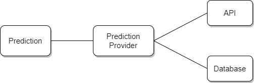

# Journal de bord

Ce journal de bord a pour but de permettre de simplifier la rédaction du rapport final de stage de technicien. Le stage de technicien est un POC (proof of concept) du travail de diplôme de technicien. Il contiendra toutes les réflexions, les éléments techniques liés à votre travail, résumés des rencontres avec des enseignants, élèves, etc.

## Contenu

### 30.03.2021

Premier jour de stage. Début du POC

Contact par e-mail avec Monsieur Schmid pour être sûr du contenu du POC :

* Conception de la classe pour récupérer les données de l'API
* Design Pattern "Facade" qui permet de simplifier la communication entre l'API et le programme.
  * Permettra de garder la même façade si un jour l'API change


9h40 
Début de l'implémentation de la facade. Librairie requests python. Lorsqu'on appel le endpoint de l'API, on reçoit le contenu en byte ( ex : `b'Mon text'` ), il faut alors le convertir en string -> `content.decode("utf-8")`

10h00

Avancement dans les requêtes pour l'API. Création d'une classe ApiFacade qui contient une méthode `getAction(request_params)`. Les autres méthodes (comme par ex: `getH2H(first_team_name, second_team_name)`) appeleront la méthode `getAction` avec les paramètres spécifiques à chacune de ces méthodes.

```python
def getAction(self, request_params):
        response = requests.get('https://apiv2.apifootball.com/?APIkey={key}&{params}'.format(key=self.api_key, params=request_params))

        if response.status_code == 200: # Code 200 = OK. Healthy connection
            return response.content.decode('utf-8') # decode to get the content in string
        # TODO : VERIFICATION IF THE CODE IS NOT 200
```

Voici la méthode `getAction` en question.

```python
def getCountries(self):
        endpoint_action = "get_countries"
        return self.getAction('action={action}'.format(action=endpoint_action))
```

Et ce à quoi ressemble la méthode `getCountries()`. Cela permet de réduire considérablement le nombre de ligne de la façade et de rendre son code plus simple.

10h30

Ajout de la librairie `dotenv` au projet. Cela permet d'apporter une certaine sécurité sur la clé de mon API. Surtout lorsque l'on ne peut pas la réinitialiser.

12h40

Entretien avec M. Schmid :

* La classe Facade est globalement bien
  * Retourner un objet ou un tableau à la sortie de la requête et non une string
  * Sortir une exception si le `status_code` n'est pas égal à 200
    * Si exception -> try catch plus tard __/ ! \\__
* Faire des logs pour les appels à l'API pour avoir une traçabilité sur ce qui est fait.

14h

Méthode `getAction` passe en privé. 

Soucis avec la librairie de log pour l'écriture des log d'info de l'application.

15h

Après discussion avec M. Garcia, ce dernier m'a expliqué que généralement les librairies de logging contiennent des niveaux et ces derniers sont utilisés pour le filtrage des logs.

#### Récap de la journée

Travail fait :

* Design pattern -> bien implémenté mais test de toutes les méthodes

* Ajout de dotenv pour éviter de stocker la clé de l'API dans un fichier et qu'elle soit publiée sur GitHub
* Logging fait 

Chose à faire impérativement : 

* Gérer un cas ou le retour de l'API est vide ou donne une erreur -> Comme une clé invalide par exemple
* NE PAS OUBLIER DE COMMUNIQUER AVEC L'ÉQUIPE DE L'API POUR LEUR MONTRER L'AVANCEMENT DU TRAVAIL APRES LES JOURS DE STAGES

### 31.03.2021

__/ ! \\ A NOTER QUE__ 

* Lorsque l'API envoie une erreur -> c'est un dico
* Lorsqu'elle envoie une réponse normale -> c'est une liste

9h

Début de la doc du rapport de stage : Introduction

9h40

Réflexion sur l'architecture du projet et sur le diagramme de classe

Discussion avec M. Schmid sur la réflexion de l'architecture du projet et du diagramme de classe, ce qui en est sorti :

* Mieux d'avoir un dossier pour chaque "fonctionnalité" (voir l'image correspondant) que d'avoir un dossier "lib" ou "all"
* Choix de l'insertion des statistiques dans la classe "Team" correct
  * "Team" n'est plus une classe mais une structure qui contient uniquement des données
  * Une classe "TeamManager" sera présente pour faire le lien entre "ApiFacade", la DB et la classe "Team". Elle aura des méthodes pour pouvoir créer des équipes, appeler l'API pour récupérer des équipes, etc.
  * La classe "TeamManager" sera contenu dans Main.
    * Pour l'élaboration des prédiction, lors de la création de la prédiction, on passera en paramètres, les équipes ainsi que le résultat de la requête H2H
* La méthode pour déterminer qui gagne lors d'une rencontre sera privé et contenu dans la classe Prédiction


 


11h

Suite de la rédaction du rapport : Logging, Dotenv, Facade

11h34

Information : Ne pas oublier de faire le MLD de la BDD

12h40

Fin de la rédaction sur ce qui a été fait le 30.03.2021

13h15

MLD de la base de données que nous allons utiliser pour stocker les prédictions faites

Discussion sur le MLD avec M. Schmid pour être sur d'être sur la bonne voie au niveau de l'implémentation et de l'utilisation de la base de données


J'avais pensé faire deux tables en me basant sur la page d'accueil prévu. Après la discussion avec M. Schmid, il s'avère qu'il est préférable de faire une seule table pour pouvoir stocker les prédictions hypothétiques.


CORRECTION : champ "real_match" inutile, car si "api_match_id" existe -> le match est officiel

14h30

Création de la base de données et importation du script pour la table -> Moteur : InnoDB, utf8_general_ci

15h30

Création de l'utilisateur et export du script + base

#### Récap de la journée

Travail fait :

* Création du MLD, script SQL pour la base de données
* Rédaction du rapport de stage : Intro + Tout ce qui a été fait jour 1
* Choix de l'architecture du projet

Chose à faire ou à noter :

* Quand l'API envoie une 404 -> c'est une 200 pour la librairie requests mais il faut gérer ce cas correctement
* Quand l'API envoie cette erreur, c'est un dico
* Quand l'API envoie une réponse normale, c'est une liste ou un objet.
* Se rappeler de changer le README
  * Préciser qu'il faut importer la DB

* Classe "TeamManager" gèrera la création des équipes et fera la relation avec la DB et API
* Faire le script pour la communication avec la DB
  * SELECT
  * INSERT
  * UPDATE
* Stocker le résultat de la requête H2H dans Prediction pour éviter une répétition lors des appels
* Ne pas oublier de communiquer avec l'équipe de l'API sur l'avancement du projet

### 12.04.2021

Chose à faire aujourd'hui :

* Gérer les potentielles erreurs de l'API
* Faire le script de la DB pour les requêtes
* Compléter le rapport avec ce qui a été fait le 31.03.2021

7h30 Rédaction du rapport

8h Implémentation de la classe pour gérer la base de données

Pour la connexion à la base de données, il faut le driver pour pouvoir le faire en python donc : 

```bash
pip3 install mysql-connector-python
```

9h Discussion avec M. Garcia pour discuter d'une situation qui n'a rien à voir avec le stage

9h30 Reprise de l'implémentation de la gestion de la base de données

Erreur de connexion à la base de données. La connexion se fait correctement avec l'utilisateur créé depuis le terminal mais le script me retourne une erreur. (`mysql.connector.errors.ProgrammingError: 1045 (28000): Access denied for user 'davidplnmr'@'localhost' (using password: NO)`)

Pourtant, je donne bien le mot de passe et le nom d'utilisateur

Oubli de ma part d'ajouter la ligne qui permet de charger le fichier d'environnement :( -> :)

12h40

Après passage de M. Schmid, rappel du rôle du provider (anciennement appelé "TeamManager"). Il permettra de gérer l'interaction avec la base de données et les requêtes pour l'API.

13h50 Fin de l'implémentation de la classe pour la gestion de la base de données

Mise à jour du schéma de la base de données


15h Rédaction du rapport sur ce qui a été fait du côté de la base de données

16h30 Envoi du GitHub à l'équipe qui gère APIFootball

#### Récap de la journée

* Fin de l'implémentation de la classe DbManager
* Actuellement à 7500/9000 charactères sur le rapport
* Rapport pas entièrement rédigé au niveau du DbManager mais quand même bien avancé

Ce qu'il faut faire demain :

* Rapport stage
  * Description de l'architecture du projet (architecture des fichiers / base de données MLD)
  * Explication du code de la classe DbManager
* Gérer les potentielles erreurs sur les requêtes de l'API

### 13.04.2021
7h30 Ajout de select pour récupérer des enregistrements selon le nom de l'équipe (peu importe si l'équipe est dans "Home" ou "Away") + Récupération de prédiction selon api_match_id

8h15 Mise à jour du rapport partie "BDD"

9h15 Redaction rapport sur l'architecture du projet 

12h40 Gestion des erreurs pour l'appel à l'API

Si on envoie une mauvais clé d'API, on reçoit une erreur 200 du côté de la lib "request" mais c'est une 404 de la part de l'api. Le type de cette erreur 404 est un dictionnaire. Cependant l'API retourne des objets ou des listes.

13h50 Gestion des erreurs provenant de l'API réglé -> Peaufinement du rapport en parlant de cette gestion d'erreur

14h45 Début de l'élaboration du provider qui va sous traiter toutes les demandes de la classe Prediction.

Permettre de récupérer toutes les statistiques d'une équipe sous forme de tableau

Bloqué sur l'importation de module

16h

Après discussion avec Florian Burgener pour savoir si il est possible d'importer un module depuis un autre dossier :

* Impossible d'importer ce module de manière simple
  * Il est tout de même possible mais il faut trifouiller pour pouvoir y arriver
    * La plus value ne sera pas énorme, mais voir si on part là dessus ou pas

Communication avec M. Schmid est nécessaire pour voir ce qu'il y a à faire

Résumé du problème :


Est-ce que je dois revoir entièrement l'arborescence de mon application? Est-ce que je change uniquement l'emplacement de mon provider?

Pas encore de réponse à ça

Après discussion et recherche de solutions avec M. Schmid. Il faut faire un dossier qui contiendra à la racine provider et la classe prediction et dans ce dossier on aura le dossier api et sql

#### Recap de la journée

* Gestion des erreurs API fait
* Ajout de SELECT statement dans DbManager
* Rédaction du rapport sur DbManager et gestion erreur API

#### A faire demain 

* Changer l'arborescence des fichiers
* Changer la partie du rapport qui parle de l'architecture de l'application
* Commencer enfin le code du provider

### 14.04.2021

Choses à faire pour aujourd'hui :

* Changer l'arborescence de fichiers du projet [DONE]
  * Tester l'importation des modules [DONE]
* Modifier le rapport par rapport à l'arborescence de fichier [DONE]
* Commencer à coder le provider [DONE]
* Tester la connexion au serveur qui m'a été donné par le tuteur [DONE]

7h30 Changement de l'arborescence + test de l'importation des modules dans le provider

8h00 L'importation de modules fonctionne. En parler dans le rapport et expliquer le soucis avec l'importation

8h30 Fin de la rédaction de la modification de l'architecture du projet.


9h Début de la fonction `getAllStatsFromTeams()`

9h40 Ok gros problème. Tout les matchs n'ont pas toutes les statistiques qu'il me faut pour faire une prédiction

Si toutes les statistiques dont on a besoin ne sont pas là, on ne prend pas ce match pour établir la prédiction? Cela peut fausser le résultat de la prédiction :/

Création d'une constante contenant toutes les statistiques nécessaires à avoir sur un match. Si une de ces stats manque, on ne prend pas le match en compte pour la prédiction.

Actuellement à la recherche d'une méthode qui me permet de vérifier que tout le tableau est dans un autre tableau peu importe l'ordre

Après aide de Jonathan et Lorenzo on a trouvé une solution

12h40 Reprise du travail et de la récupération des statistiques pour chacun des matchs

13h15 Récupération effectuée pour les statistiques de chaque match en confrontation pure entre les équipes chaque équipe

15h Fin de la récupération des statistiques pour chaque match entre les équipes

Début de la rédaction de cette activité



Schéma du provider en version numérique pour l'insérer dans le rapport

#### Recap de la journée 

* Changement léger de l'architecture du projet
* Test de connexion au serveur donné par le tuteur de stage
* Rédaction du rapport
* Implémentation du traitement + récupération des statistiques pour chaque match

Choses à faire demain :

* Bilan personnel du stage
  * compétences sociales
* Conclusion
  * Synthèse du stage
  * Remerciements

### 15.04.2021

9h Bilan personnel

10h	Conclusion

11h	Correction orthographique 

12h40 Début du PowerPoint

14h15 Fin du PowerPoint

14h15 On continue à bosser sur le provider

15h La classe Prediction n'a plus besoin du Provider, maintenant il faut faire les méthodes pour le fichier principal du projet. Donc une méthode `getUpcomingMatches()`

### 19.04.2021

8h Provider ajout de la sauvegarde dans la base de données et rename du projet en "football-prediction"

9h Début de la classe Prediction

Passage de M. Schmid cette après-midi pour parler du stage dans sa globalité (points à améliorer, etc.)

Quelques questions :

* Oral à améliorer...
* Logbook ok?
* Rapport ok?
  * LaTeX ou MD into readthedoc?

9h30 Compute_heat_moment --> calculer la forme du moment de l'équipe sur les 5 derniers matchs

Forme du match faite. Test de potentielle erreur -> exception

throw exception si aucun resultat dans les matchs récent


La on arrive dans le sujet assez compliqué, c'est là ou il va falloir établir une pondération correct pour chaque statistique

13h Review du stage. Tout est bon sauf l'oral ou il va falloir se préparer plus et faire des oraux à blanc supplémentaires.

13h15 Début de rédaction du rapport

14h35 Réflexion sur l'importance de chacune des statistiques : 

La statistique "Tirs bloqués" est la statistique du côté de l'équipe qui a tiré et non de l'équipe qui a bloqué. On ne peut pas l'utiliser pour le score défensif


