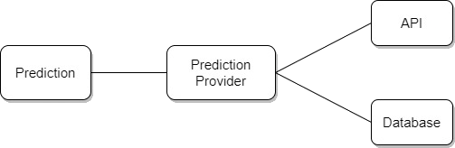
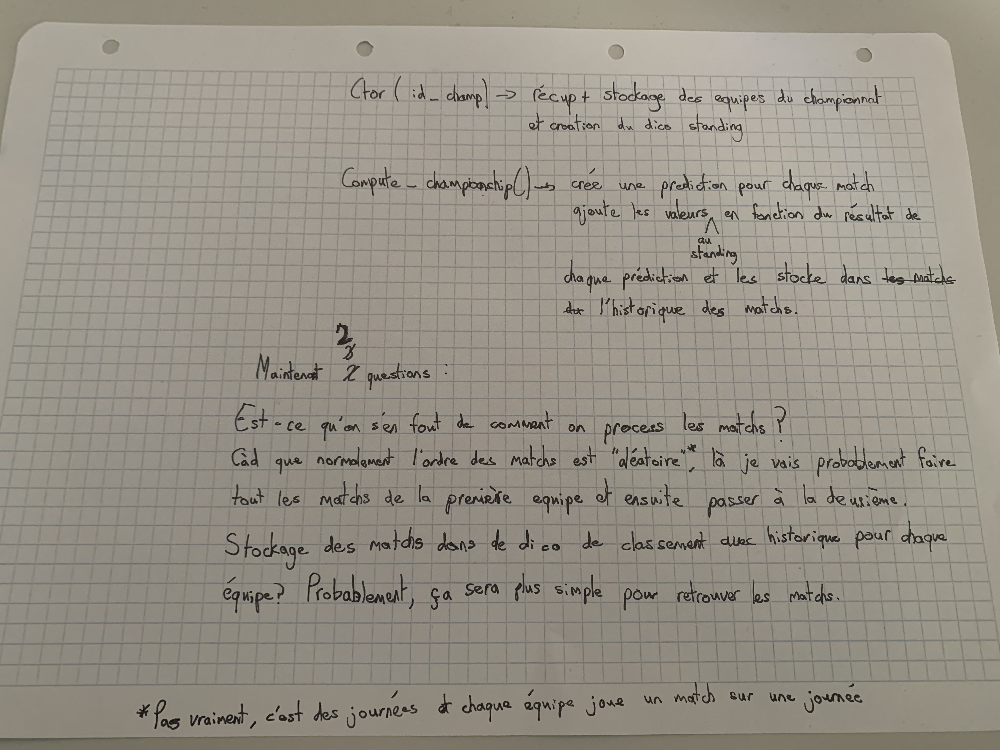
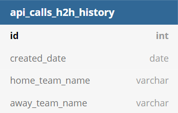
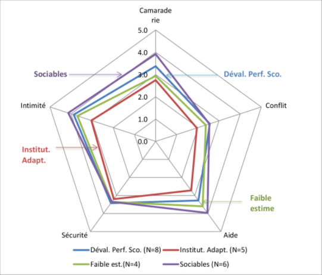

# Journal de bord

Ce journal de bord a pour but de permettre de simplifier la rédaction du rapport final de stage de technicien. Le stage de technicien est un POC (proof of concept) du travail de diplôme de technicien. Il contiendra toutes les réflexions, les éléments techniques liés à votre travail, résumés des rencontres avec des enseignants, élèves, etc.

# Contenu

## Stage

### 30.03.2021

Premier jour de stage. Début du POC

Contact par e-mail avec Monsieur Schmid pour être sûr du contenu du POC :

* Conception de la classe pour récupérer les données de l'API
* Design Pattern "Facade" qui permet de simplifier la communication entre l'API et le programme.
  * Permettra de garder la même façade si un jour l'API change


9h40 
Début de l'implémentation de la facade. Librairie requests python. Lorsqu'on appel le endpoint de l'API, on reçoit le contenu en byte ( ex : `b'Mon text'` ), il faut alors le convertir en string -> `content.decode("utf-8")`

10h00

Avancement dans les requêtes pour l'API. Création d'une classe ApiFacade qui contient une méthode `getAction(request_params)`. Les autres méthodes (comme par ex: `getH2H(first_team_name, second_team_name)`) appeleront la méthode `getAction` avec les paramètres spécifiques à chacune de ces méthodes.

```python
def getAction(self, request_params):
        response = requests.get('https://apiv2.apifootball.com/?APIkey={key}&{params}'.format(key=self.api_key, params=request_params))

        if response.status_code == 200: # Code 200 = OK. Healthy connection
            return response.content.decode('utf-8') # decode to get the content in string
        # TODO : VERIFICATION IF THE CODE IS NOT 200
```

Voici la méthode `getAction` en question.

```python
def getCountries(self):
        endpoint_action = "get_countries"
        return self.getAction('action={action}'.format(action=endpoint_action))
```

Et ce à quoi ressemble la méthode `getCountries()`. Cela permet de réduire considérablement le nombre de ligne de la façade et de rendre son code plus simple.

10h30

Ajout de la librairie `dotenv` au projet. Cela permet d'apporter une certaine sécurité sur la clé de mon API. Surtout lorsque l'on ne peut pas la réinitialiser.

12h40

Entretien avec M. Schmid :

* La classe Facade est globalement bien
  * Retourner un objet ou un tableau à la sortie de la requête et non une string
  * Sortir une exception si le `status_code` n'est pas égal à 200
    * Si exception -> try catch plus tard __/ ! \\__
* Faire des logs pour les appels à l'API pour avoir une traçabilité sur ce qui est fait.

14h

Méthode `getAction` passe en privé. 

Soucis avec la librairie de log pour l'écriture des log d'info de l'application.

15h

Après discussion avec M. Garcia, ce dernier m'a expliqué que généralement les librairies de logging contiennent des niveaux et ces derniers sont utilisés pour le filtrage des logs.

#### Récap de la journée

Travail fait :

* Design pattern -> bien implémenté mais test de toutes les méthodes

* Ajout de dotenv pour éviter de stocker la clé de l'API dans un fichier et qu'elle soit publiée sur GitHub
* Logging fait 

Chose à faire impérativement : 

* Gérer un cas ou le retour de l'API est vide ou donne une erreur -> Comme une clé invalide par exemple
* NE PAS OUBLIER DE COMMUNIQUER AVEC L'ÉQUIPE DE L'API POUR LEUR MONTRER L'AVANCEMENT DU TRAVAIL APRES LES JOURS DE STAGES

### 31.03.2021

__/ ! \\ A NOTER QUE__ 

* Lorsque l'API envoie une erreur -> c'est un dico
* Lorsqu'elle envoie une réponse normale -> c'est une liste

9h

Début de la doc du rapport de stage : Introduction

9h40

Réflexion sur l'architecture du projet et sur le diagramme de classe

Discussion avec M. Schmid sur la réflexion de l'architecture du projet et du diagramme de classe, ce qui en est sorti :

* Mieux d'avoir un dossier pour chaque "fonctionnalité" (voir l'image correspondant) que d'avoir un dossier "lib" ou "all"
* Choix de l'insertion des statistiques dans la classe "Team" correct
  * "Team" n'est plus une classe mais une structure qui contient uniquement des données
  * Une classe "TeamManager" sera présente pour faire le lien entre "ApiFacade", la DB et la classe "Team". Elle aura des méthodes pour pouvoir créer des équipes, appeler l'API pour récupérer des équipes, etc.
  * La classe "TeamManager" sera contenu dans Main.
    * Pour l'élaboration des prédiction, lors de la création de la prédiction, on passera en paramètres, les équipes ainsi que le résultat de la requête H2H
* La méthode pour déterminer qui gagne lors d'une rencontre sera privé et contenu dans la classe Prédiction


 


11h

Suite de la rédaction du rapport : Logging, Dotenv, Facade

11h34

Information : Ne pas oublier de faire le MLD de la BDD

12h40

Fin de la rédaction sur ce qui a été fait le 30.03.2021

13h15

MLD de la base de données que nous allons utiliser pour stocker les prédictions faites

Discussion sur le MLD avec M. Schmid pour être sur d'être sur la bonne voie au niveau de l'implémentation et de l'utilisation de la base de données


J'avais pensé faire deux tables en me basant sur la page d'accueil prévu. Après la discussion avec M. Schmid, il s'avère qu'il est préférable de faire une seule table pour pouvoir stocker les prédictions hypothétiques.


CORRECTION : champ "real_match" inutile, car si "api_match_id" existe -> le match est officiel

14h30

Création de la base de données et importation du script pour la table -> Moteur : InnoDB, utf8_general_ci

15h30

Création de l'utilisateur et export du script + base

#### Récap de la journée

Travail fait :

* Création du MLD, script SQL pour la base de données
* Rédaction du rapport de stage : Intro + Tout ce qui a été fait jour 1
* Choix de l'architecture du projet

Chose à faire ou à noter :

* Quand l'API envoie une 404 -> c'est une 200 pour la librairie requests mais il faut gérer ce cas correctement
* Quand l'API envoie cette erreur, c'est un dico
* Quand l'API envoie une réponse normale, c'est une liste ou un objet.
* Se rappeler de changer le README
  * Préciser qu'il faut importer la DB

* Classe "TeamManager" gèrera la création des équipes et fera la relation avec la DB et API
* Faire le script pour la communication avec la DB
  * SELECT
  * INSERT
  * UPDATE
* Stocker le résultat de la requête H2H dans Prediction pour éviter une répétition lors des appels
* Ne pas oublier de communiquer avec l'équipe de l'API sur l'avancement du projet

### 12.04.2021

Chose à faire aujourd'hui :

* Gérer les potentielles erreurs de l'API
* Faire le script de la DB pour les requêtes
* Compléter le rapport avec ce qui a été fait le 31.03.2021

7h30 Rédaction du rapport

8h Implémentation de la classe pour gérer la base de données

Pour la connexion à la base de données, il faut le driver pour pouvoir le faire en python donc : 

```bash
pip3 install mysql-connector-python
```

9h Discussion avec M. Garcia pour discuter d'une situation qui n'a rien à voir avec le stage

9h30 Reprise de l'implémentation de la gestion de la base de données

Erreur de connexion à la base de données. La connexion se fait correctement avec l'utilisateur créé depuis le terminal mais le script me retourne une erreur. (`mysql.connector.errors.ProgrammingError: 1045 (28000): Access denied for user 'davidplnmr'@'localhost' (using password: NO)`)

Pourtant, je donne bien le mot de passe et le nom d'utilisateur

Oubli de ma part d'ajouter la ligne qui permet de charger le fichier d'environnement :( -> :)

12h40

Après passage de M. Schmid, rappel du rôle du provider (anciennement appelé "TeamManager"). Il permettra de gérer l'interaction avec la base de données et les requêtes pour l'API.

13h50 Fin de l'implémentation de la classe pour la gestion de la base de données

Mise à jour du schéma de la base de données


15h Rédaction du rapport sur ce qui a été fait du côté de la base de données

16h30 Envoi du GitHub à l'équipe qui gère APIFootball

#### Récap de la journée

* Fin de l'implémentation de la classe DbManager
* Actuellement à 7500/9000 charactères sur le rapport
* Rapport pas entièrement rédigé au niveau du DbManager mais quand même bien avancé

Ce qu'il faut faire demain :

* Rapport stage
  * Description de l'architecture du projet (architecture des fichiers / base de données MLD)
  * Explication du code de la classe DbManager
* Gérer les potentielles erreurs sur les requêtes de l'API

### 13.04.2021
7h30 Ajout de select pour récupérer des enregistrements selon le nom de l'équipe (peu importe si l'équipe est dans "Home" ou "Away") + Récupération de prédiction selon api_match_id

8h15 Mise à jour du rapport partie "BDD"

9h15 Redaction rapport sur l'architecture du projet 

12h40 Gestion des erreurs pour l'appel à l'API

Si on envoie une mauvais clé d'API, on reçoit une erreur 200 du côté de la lib "request" mais c'est une 404 de la part de l'api. Le type de cette erreur 404 est un dictionnaire. Cependant l'API retourne des objets ou des listes.

13h50 Gestion des erreurs provenant de l'API réglé -> Peaufinement du rapport en parlant de cette gestion d'erreur

14h45 Début de l'élaboration du provider qui va sous traiter toutes les demandes de la classe Prediction.

Permettre de récupérer toutes les statistiques d'une équipe sous forme de tableau

Bloqué sur l'importation de module

16h

Après discussion avec Florian Burgener pour savoir si il est possible d'importer un module depuis un autre dossier :

* Impossible d'importer ce module de manière simple
  * Il est tout de même possible mais il faut trifouiller pour pouvoir y arriver
    * La plus value ne sera pas énorme, mais voir si on part là dessus ou pas

Communication avec M. Schmid est nécessaire pour voir ce qu'il y a à faire

Résumé du problème :


Est-ce que je dois revoir entièrement l'arborescence de mon application? Est-ce que je change uniquement l'emplacement de mon provider?

Pas encore de réponse à ça

Après discussion et recherche de solutions avec M. Schmid. Il faut faire un dossier qui contiendra à la racine provider et la classe prediction et dans ce dossier on aura le dossier api et sql

#### Recap de la journée

* Gestion des erreurs API fait
* Ajout de SELECT statement dans DbManager
* Rédaction du rapport sur DbManager et gestion erreur API

#### A faire demain 

* Changer l'arborescence des fichiers
* Changer la partie du rapport qui parle de l'architecture de l'application
* Commencer enfin le code du provider

### 14.04.2021

Choses à faire pour aujourd'hui :

* Changer l'arborescence de fichiers du projet [DONE]
  * Tester l'importation des modules [DONE]
* Modifier le rapport par rapport à l'arborescence de fichier [DONE]
* Commencer à coder le provider [DONE]
* Tester la connexion au serveur qui m'a été donné par le tuteur [DONE]

7h30 Changement de l'arborescence + test de l'importation des modules dans le provider

8h00 L'importation de modules fonctionne. En parler dans le rapport et expliquer le soucis avec l'importation

8h30 Fin de la rédaction de la modification de l'architecture du projet.


9h Début de la fonction `getAllStatsFromTeams()`

9h40 Ok gros problème. Tout les matchs n'ont pas toutes les statistiques qu'il me faut pour faire une prédiction

Si toutes les statistiques dont on a besoin ne sont pas là, on ne prend pas ce match pour établir la prédiction? Cela peut fausser le résultat de la prédiction :/

Création d'une constante contenant toutes les statistiques nécessaires à avoir sur un match. Si une de ces stats manque, on ne prend pas le match en compte pour la prédiction.

Actuellement à la recherche d'une méthode qui me permet de vérifier que tout le tableau est dans un autre tableau peu importe l'ordre

Après aide de Jonathan et Lorenzo on a trouvé une solution

12h40 Reprise du travail et de la récupération des statistiques pour chacun des matchs

13h15 Récupération effectuée pour les statistiques de chaque match en confrontation pure entre les équipes chaque équipe

15h Fin de la récupération des statistiques pour chaque match entre les équipes

Début de la rédaction de cette activité



Schéma du provider en version numérique pour l'insérer dans le rapport

#### Recap de la journée 

* Changement léger de l'architecture du projet
* Test de connexion au serveur donné par le tuteur de stage
* Rédaction du rapport
* Implémentation du traitement + récupération des statistiques pour chaque match

Choses à faire demain :

* Bilan personnel du stage
  * compétences sociales
* Conclusion
  * Synthèse du stage
  * Remerciements

### 15.04.2021

9h Bilan personnel

10h	Conclusion

11h	Correction orthographique 

12h40 Début du PowerPoint

14h15 Fin du PowerPoint

14h15 On continue à bosser sur le provider

15h La classe Prediction n'a plus besoin du Provider, maintenant il faut faire les méthodes pour le fichier principal du projet. Donc une méthode `getUpcomingMatches()`

## Début TD

### 19.04.2021

8h Provider ajout de la sauvegarde dans la base de données et rename du projet en "football-prediction"

9h Début de la classe Prediction

Passage de M. Schmid cette après-midi pour parler du stage dans sa globalité (points à améliorer, etc.)

Quelques questions :

* Oral à améliorer...
* Logbook ok?
* Rapport ok?
  * LaTeX ou MD into readthedoc?

9h30 Compute_heat_moment --> calculer la forme du moment de l'équipe sur les 5 derniers matchs

Forme du match faite. Test de potentielle erreur -> exception

throw exception si aucun resultat dans les matchs récent


La on arrive dans le sujet assez compliqué, c'est là ou il va falloir établir une pondération correct pour chaque statistique

13h Review du stage. Tout est bon sauf l'oral ou il va falloir se préparer plus et faire des oraux à blanc supplémentaires.

13h15 Début de rédaction du rapport

14h35 Réflexion sur l'importance de chacune des statistiques : 

La statistique "Tirs bloqués" est la statistique du côté de l'équipe qui a tiré et non de l'équipe qui a bloqué. On ne peut pas l'utiliser pour le score défensif


#### Recap de la journée

* Heat of the moment done
* Classement des stats fait
* Avancement sur le rapport

Ce qu'il faut faire demain :

* Un trello (et le partager au prof)
* Avancer dans le rapport
* Commencer à développer la méthode `compute_off_score()`

### 20.04.2021

8h Début de la création du Trello ensuite on va commencer à coder

Le Trello, en plus du logbook, permet à quelqu'un de reprendre mon travail et de savoir ou j'en suis dans mon projet (les tâches faites ce qu'il me manque à faire etc.)

9h On code le calcul du score offensif

Pour le calcul du score, Suite de Fibonacci? 1,2,3,4,5,6,..?

Est-ce que c'est plus simple de faire une moyenne de chaque stat et ensuite appliquer la pondération?

On part sur la moyenne de chaque stat, c'est plus logique et ça affaiblit moins l'équipe qui a moins de match

Les équipes ont les mêmes stats, car je prend tout les tableaux des statistiques. 

Correction de ce soucis

Création d'une classe TeamResult qui va être utilisé dans Prediction

Après discussion avec M. Garcia, il m'a expliqué explicitement la question qu'il a posé lors du stage pour qui était :

Est-ce que c'est possible de récupérer les résultats d'une compétition entière en 2019 et de prédire le résultat d'un match en 2020 (qui c'est réellement passé) pour pouvoir tester les prédictions? 

Effectivement, ça serait utile pour pouvoir tester l'application de manière efficace

12h Début de la méthode insertion de matchs dans la base avec les stats qu'il faut

12h40 M. Schmid vient valider l'idée de M. Garcia

Comment j'insère dans la base de données les match provenant de l'API maintenant?

J'insère du 1er janvier 2016 au 31 décembre 2020 en Premier League ( id=148 )

Erreur d'insertion dans la base

```bash
SQL Error [1064] [42000]: (conn=75) You have an error in your SQL syntax; check the manual that corresponds to your MariaDB server version for the right syntax to use near 'match (			`id`, ...
```

```SQL
INSERT INTO match (			`id`, 
                            `match_date`, 
                            `match_time`, 
                            `league_id`, 
                            `league_name`, 
                            `hometeam_name`,
                            `awayteam_name`,
                            `hometeam_score`,
                            `awayteam_score`)
                            VALUES ( 273385,  STR_TO_DATE("2020-03-09", "%Y-%m-%d"), "21:00", 148, "Premier League", "Leicester", "Aston Villa", 4, 0);
```

Avec la requête SQL suivante

Il s'avère que "match" est un mot sql reservé (MATCH AGAINST). Oubli de ma part

Insertion dans la base de données faite avec le script `loadDataInDb`

Query pour récupérer tout les matchs de deux et les statistiques de chacun de ces matchs

```sql
SELECT m.id, m.date, m.time, m.hometeam_name, m.awayteam_name, s.`type`, IF (s.`type`="Ball Possession", s.home , NULL) as ball_possession_home,IF (s.`type`="Ball Possession", s.away , NULL) as ball_possession_away
FROM `match` m 
LEFT JOIN `statistic` s 
ON m.id = s.id_match
WHERE (m.hometeam_name="Wolves" OR m.awayteam_name="Wolves") AND (m.hometeam_name="Chelsea" OR m.awayteam_name="Chelsea");
```

Je veux que la requête me retourne chaque match avec comme attribut la statistique de l'équipe à l'extérieur (pour un type de stat) et à domicile

| id     | date       | time     | hometeam_name | awayteam_name | ...  | ball_possession_home | ball_possession_away | goal_attempts_home | goal_attempts_away | ...  |
| ------ | ---------- | -------- | ------------- | ------------- | ---- | -------------------- | -------------------- | ------------------ | ------------------ | ---- |
| 158541 | 2018-12-05 | 20:45:00 | Wolves        | Chelsea       |      | 29%                  | 71%                  | 25                 | 12                 | ...  |

Exemple juste au dessus

Autrement je peux faire deux requêtes. Une qui récupère tout les matchs et une qui récupère toutes les statistiques pour chaque match

#### Recap de la journée 

* Changement de structure de la base de données pour pouvoir tester efficacement les prédictions
* Trello fait
* Choix de faire une moyenne par match pour chaque
  * Classe TeamResult qui stocker les résultats des équipes
* Insertion de données dans la table "match"

Choses à faire demain :

* La requête qui me permet de récup toutes les stats par match
  * Autrement faire ça en deux requêtes
    * Ou potentiellement en trois (firstTeam_VS_secondTeam, firstTeam_lastResults, secondTeam_lastResults)
  * Si la requête est fait -> faire la méthode dans le provider pour mettre les données dans le bon format
* Continuer dans le rapport

### 21.04.2021

8h Vu la requête que je veux (qui m'a l'air impossible à faire)

```sql
SELECT m.id, m.date, m.time, m.hometeam_name, m.awayteam_name
FROM `match` m
WHERE (m.hometeam_name="Wolves" OR m.awayteam_name="Wolves") AND m.`date` < "2019-09-19";
```

Last results from a team before a date (pour me permettre de faire la calibration des prédictions)

```sql
SELECT m.id, m.date, m.time, m.hometeam_name, m.awayteam_name
FROM `match` m
WHERE (m.hometeam_name="Wolves" OR m.awayteam_name="Wolves") AND (m.hometeam_name="Chelsea" OR m.awayteam_name="Chelsea") AND m.`date` < "2019-09-19";
```

Récupère les derniers résultats entre les deux équipes.

Je vais faire 3 requêtes au total pour récupérer les résultats précédents des équipes. Pour simplifier la transition dans le format suivant 

```json
[
	{
	  "firstTeam_VS_secondTeam": [
		{
		  "match_id": "218349",
		  "country_id": "165",
		  "country_name": "Europe",
		  "league_id": "590",
		  "league_name": "Europa League",
		  "match_date": "2019-05-29",
		  "match_status": "Finished",
		  "match_time": "21:00",
		  "match_hometeam_id": "2616",
		  "match_hometeam_name": "Chelsea",
		  "match_hometeam_score": "4 ",
		  "match_awayteam_id": "2617",
		  "match_awayteam_name": "Arsenal",
		  "match_awayteam_score": " 1",
		  "match_hometeam_halftime_score": "0",
		  "match_awayteam_halftime_score": "0",
		  "match_live": "0"
		},
		{
		  "match_id": "167631",
		  "country_id": "41",
		  "country_name": "ENGLAND",
		  "league_id": "148",
		  "league_name": "Premier League",
		  "match_date": "2019-01-19",
		  "match_status": "Finished",
		  "match_time": "18:30",
		  "match_hometeam_id": "2617",
		  "match_hometeam_name": "Arsenal",
		  "match_hometeam_score": "2",
		  "match_awayteam_id": "2616",
		  "match_awayteam_name": "Chelsea",
		  "match_awayteam_score": "0",
		  "match_hometeam_halftime_score": "2",
		  "match_awayteam_halftime_score": "0",
		  "match_live": "0"
		},
	.....
	  ],
	  "firstTeam_lastResults": [
		{
		  "match_id": "218349",
		  "country_id": "165",
		  "country_name": "Europe",
		  "league_id": "590",
		  "league_name": "Europa League",
		  "match_date": "2019-05-29",
		  "match_status": "Finished",
		  "match_time": "21:00",
		  "match_hometeam_id": "2616",
		  "match_hometeam_name": "Chelsea",
		  "match_hometeam_score": "4 ",
		  "match_awayteam_id": "2617",
		  "match_awayteam_name": "Arsenal",
		  "match_awayteam_score": " 1",
		  "match_hometeam_halftime_score": "0",
		  "match_awayteam_halftime_score": "0",
		  "match_live": "0"
		},
		{
		  "match_id": "212425",
		  "country_id": "41",
		  "country_name": "England",
		  "league_id": "148",
		  "league_name": "Premier League",
		  "match_date": "2019-05-12",
		  "match_status": "Finished",
		  "match_time": "16:00",
		  "match_hometeam_id": "2611",
		  "match_hometeam_name": "Leicester",
		  "match_hometeam_score": "0 ",
		  "match_awayteam_id": "2616",
		  "match_awayteam_name": "Chelsea",
		  "match_awayteam_score": " 0",
		  "match_hometeam_halftime_score": "0",
		  "match_awayteam_halftime_score": "0",
		  "match_live": "0"
		},
	.....
	  ],
	  "secondTeam_lastResults": [
		{
		  "match_id": "218349",
		  "country_id": "165",
		  "country_name": "Europe",
		  "league_id": "590",
		  "league_name": "Europa League",
		  "match_date": "2019-05-29",
		  "match_status": "Finished",
		  "match_time": "21:00",
		  "match_hometeam_id": "2616",
		  "match_hometeam_name": "Chelsea",
		  "match_hometeam_score": "4 ",
		  "match_awayteam_id": "2617",
		  "match_awayteam_name": "Arsenal",
		  "match_awayteam_score": " 1",
		  "match_hometeam_halftime_score": "0",
		  "match_awayteam_halftime_score": "0",
		  "match_live": "0"
		},
		{
		  "match_id": "212422",
		  "country_id": "41",
		  "country_name": "England",
		  "league_id": "148",
		  "league_name": "Premier League",
		  "match_date": "2019-05-12",
		  "match_status": "Finished",
		  "match_time": "16:00",
		  "match_hometeam_id": "2629",
		  "match_hometeam_name": "Burnley",
		  "match_hometeam_score": "1 ",
		  "match_awayteam_id": "2617",
		  "match_awayteam_name": "Arsenal",
		  "match_awayteam_score": " 3",
		  "match_hometeam_halftime_score": "0",
		  "match_awayteam_halftime_score": "0",
		  "match_live": "0"
		},
	.....
]
```

Techniquement il y'aura beaucoup de requêtes. (une pour `firstTeam_VS_secondTeam` et une requête pour chaque match de cette requête). Soucis de performance. Comment faire? Ce qui serait le mieux serait réellement le tableau mais cela m'a l'air très compliqué à réaliser...

Après discussion avec Florian Burgener, ce qu'il y'a de mieux à faire est de récupérer les matchs des deux équipes et ensuite de faire une concatenation en python de tout les id des matchs et les insérer dans la WHERE CLAUSE avec un IN --> 

```sql
SELECT s.`type`, s.home, s.away, s.id_match FROM footballPrediction.statistic s WHERE s.id_match IN (113238,116112,155389) # IN (id_match_1, id_match_2, ...)
```

Après passage de M. Schmid, il s'avère que ce n'est pas une bonne idée car le IN a un nombre de paramètres limités, une jointure INNER suffisait pour avoir le même nombre de données

Implémentation de transaction pour l'insertion de données en base. Statistiques sont dépendantes des matchs, on ne veut donc que des statistiques soient ajoutés si le match n'est pas ajouté

12h40 Rédaction du rapport : Organisation

13h30 Début de la création de la méthode pour récupérer toutes les statistiques des équipes choisies depuis la base de données

14h35 Fin de l'implémentation de la méthode pour formater les matchs pour la classe Prediction (c'est très très moche va falloir probablement revenir dessus). Y'a des repétitions de code :/ . Le soucis c'est que la base de données n'a pas les mêmes normes de nommages que l'API (mettre `match` devant chaque attribut dans la table `match` c'est vraiment pas mon dada) et je recupère pas mes données de la même manière qu'avec l'API

15h Les requêtes pour avoir les matchs sont bonnes mais je n'arrive pas à spécifier que je veux que les matchs avant une certaines dates

```sql
SELECT m.id, m.date, m.time, m.league_id, m.league_name, m.home_team_name, m.away_team_name, m.home_team_score, m.away_team_score
FROM `match` m 
WHERE m.home_team_name="Chelsea" OR m.away_team_name="Chelsea" OR m.home_team_name="Burnley" OR m.away_team_name="Burnley" AND m.date < '2018-08-10'
```

Cette requête est clairement là pour dire que je veux les matchs de Chelsea et de Burnley avant le 10 août 2018 mais je reçois tout les matchs de Burnley et de Chelsea, même ceux qui passe outre la date spécifié

Le soucis était l'ordre des condition booléenne

```sql
SELECT m.id, m.date, m.time, m.league_id, m.league_name, m.home_team_name, m.away_team_name, m.home_team_score, m.away_team_score
FROM `match` m 
WHERE (m.home_team_name="Chelsea" OR m.away_team_name="Chelsea" OR m.home_team_name="Burnley" OR m.away_team_name="Burnley") AND m.date < "2018-08-10"
```

#### Recap de la journée

* Transformation des données de la base dans le même format que ceux de l'API
  * Comme les requêtes et la manière des requêtes sur les deux sources de données sont différentes, il y a de la "duplication" de code. Les colonnes n'ont pas le même nom que l'API
* Rapport --> Organisation

Choses à faire :

* Commencer à élaborer les prédictions

### 22.04.2021

8h Comme je fais une moyenne des stats par match, j'ai des nombres à virgules. Je vais donc changer le type des off_score et def_score dans la base de données

Les moyennes sont des nombres à virgules, pour avoir une meilleure précision (je comptes utiliser des pondération), je stockes les scores avec les virgules

Maintenant, il faut faire la pondération.

Pour l'instant je me suis basé sur la suite de Fibonacci. C'est la méthode qui est utilisé pour le poker planning dans la méthodologie Agile. 

Quelques petits trucs à noter qui sont important :

La pondération des buts marqués doit être la même que celle des buts encaissés -> Peu importe ou le but est marqué c'est la même valeur dans un match de football

La réflexion sur l'ordre des statistiques offensives est facilement réalisée

Maintenant, la partie un peu plus tricky est celle pour le score défensif. 
Certaines statistiques vont intéragir avec le score comme des malus (par exemple : cartons jaunes ou fautes). Et ces cartons jaunes et fautes sont en relation direct avec les tacles. En effet, les tacles s'ils sont bien exécuté, n'implique pas de fautes donc pas de cartons.

Observez le schéma ci-dessous pour mieux comprendre


J'ai essayé de faire un schéma suffisamment clair pour expliquer ma réflexion. J'ai ensuite fait des calculs pour expliciter mes propos :


Il faut aussi comptabiliser l'importance d'un victoire pour la prédiction. Pour ça on va aussi faire une moyenne des points obtenus par match (3pts pour une victoire, 1 pt pour une égalité et 0 pts pour une défaite)

Comme une victoire a plus d'importance quant au niveau de l'équipe j'ai décidé d'appliquer la pondération après le 8 (qui est la valeur pour les buts) dans la suite de Fibonacci : 13 --> à savoir que la valeur maximale sera de 3 donc avec la pondération --> 39

J'ai mis toutes les pondérations. Maintenant comment déterminer avec ce score final qui est le vainqueur?

12h40 Rédaction du rapport

14h35 Idée provenant de M. Schmid -> pour le score défensif prendre aussi le nombre d'attaques de l'équipe adverse. Mais comment j'agis sur la pondération avec ça? ça serait des malus sur le score défensif

Autre idée de Monsieur Schmid, avoir plus tard un sorte de script qui joue avec les pondérations des statistiques pour pouvoir avoir le meilleur résultat possible.

#### Recap de la journée

* Etablissement des scores fait
* Rédaction du rapport : Techno utilisés 

Chose à faire demain / à noter :

* Faire le script de test `test_many_prediction.py`
* Potentiellement voir pour stocker le nombre d'attaques dangereuses des équipes adverses dans le score défensif

### 23.04.2021

8h Début script pour voir le pourcentage de réussite des prédictions sur la saison 2019-20

9h Fin du script -> Test sur le pourcentage de déterminer qu'un match est une égalité -> avec 2% -> 45% de chance

10h Fichier excel de test sur le pourcentage de réussite de chaque saison pour quelques ligues

12h40 J'essaie comprendre pourquoi les prédictions ne fonctionnent pas avec les données de la super league

Quasiment tous les matchs de super league n'ont pas toutes les statistiques qu'il me faut pour faire une prédiction

J'ai trouvé qu'il y a un bug au moment ou on veut faire une prédiction. Si on a aucun match dans les derniers résultats pour établir notre prédiction et bien il faut

RECTIFICATION DU % de REUSSITE


Voici le tableau qui montre les différents % de réussite selon le niveau de delta que l'on choisit. Techniquement, on doit aussi prédire en cas d'égalité

#### Recap de la journée

* Script pour voir à quel point la prédiction est précise --> 48.5% de moyenne sur les 5 championnats majeurs
* Correction d'un bug qui faisait que des prédictions était faites sans données sur les matchs précédents

Choses à faire pour la prochaine journée : 

* Rédaction du rapport : Recherche de solution -> Expliquer comment je suis arrivé à élaborer ma prédiction. Expliquer le choix de tel pondération -> Test de la réussite de la prédiction

### 26.04.2021

8h Rédaction rapport -> Recherche de solutions 

Analyse approfondie pour pouvoir faire des prédictions entre championnat différents -> Techniquement infaisable (Partie `Niveau des différents championnats`)

10h Fin de l'explication de pourquoi c'est pas possible de connaitre le niveau d'un championnat ou d'une équipe par rapport à une autre

10h Début de la page d'accueil du site

12h40 On continue à appréhender Python Flask et à mettre un bon template bootstrap en place

15h Ajout de colonne "league_name" et "league_id"

Update finalement il sert à rien

16h L'appel à la méthode pour récupérer les prédictions fait une erreur 500 sur Flask

Ok finalement après avoir activé le debug c'était un soucis d'appel

Maintenant il faut voir pourquoi est-ce que je ne reçois rien dans les prédictions précédentes

#### Recap de la journée 

* Redaction du rapport -> Niveau des différents championnats
* Création des templates du site avec Flask

Choses à faire demain : 

* Continuer la rédaction "Recherche de solutions"
* Continuer à développer la page Home du site avec "Previous Games"

### 27.04.2021

8h Récupération des matchs précédents avec leur prédictions

10h Récupération des prochains matchs + création d'une prédiction pour chacun d'eux

Dans la page d'accueil, recherche de solutions pour créer des prédictions automatiques pour tout les nouveau matchs

Par contre le soucis c'est que la page met du temps à charger selon le nombre de matchs à prédire.

Potentiellement faire une route qui est appelé de manière journalière. chron ?

Explication du soucis avec les imports à Monsieur Schmid après recherche

Finalement, uniquement changer le PYTHONPATH vers le chemin du module qu'on veut importer 

Solution 1 -> https://dkhambu.medium.com/importing-files-in-python-repository-28ab49fade37


Maintenant on repasse a la création d'une prédiction si le match est nouveau

Upcoming matches fait pour une ligue. Maintenant, on fait une autre méthode qui récupère tout les prochains matchs


16h10 Cache sur l'affichage des predictions sur la page d'accueil autrement la page d'accueil tout est bon

#### Recap de la journée

* Match précédents sur l'accueil
* Prochains matchs dans l'accueil + cache
* Gestion des importations des modules perfectionnés

Choses à faire demain :

* Rapport rapport et rapport -> Résumé + Abstract, Récupération des données et des matchs
  * Ne pas oublier de mettre a jour le Trello

### 28.04.2021

8h Création de la page Head To Head

PS : Ne pas oublier de rendre la page d'accueil plus friendly (ordre chronologique des matchs, pouvoir ajouter la ligue sur la prédiction pour avoir un accueil filtré par ligue -> ça va nécessiter de changer quelques méthodes et d'ajouter une colonne sur la table prédiction)

10h Rapport `Récupération des matchs et de leurs statistiques`

12h Rapport `Choix de la pondération des statistiques`

15h30 Test des predictions depuis un autre repos : https://stackoverflow.com/questions/57328142/modulenot-founderror-no-module-named-lib

#### Recap de la journée 

* Rapport, rapport et rapport... -> Récup match + stats et Choix pondération stat
* Début création Head To Head
* Fixer un soucis que j'ai remarqué dans les constantes de l'appli "DRAW=WIN=LOSE" aucun sens :/

Choses à faire demain :

* Continuer a faire le head to head sur le site
* Changer le tableau excel sur la réussite de la prédiction et le mettre à jour sur git toussa toussa
* Continuer le rapport : Résumé + Abstract

### 29.04.2021


8h Voila le pourcentage de réussite après avoir fix le soucis des constantes de victoire, égalité, défaite

9h Affichage plus correct sur la page d'accueil avec chaque ligue

10h Essai de mettre la classe bootstrap select picker

C'est abominable, si j'essaie d'importer le style du composant bootstrap le style de base de mon site se fait marcher dessus et si j'enlève juste le css, le composant s'affiche pas.

ça m'aurait permis juste de transmettre les équipes pour la page h2h

Bon du coup on va le faire sans fonction de recherche juste avec un optgroup pour chaque ligue

Ok pour faire la création de la prédiction Head To Head j'ai besoin de faire une route pour chaque étape de la création de la prédiction

Actuellement en train de voir comment fonctionne la récupération de données d'un formulaire avec Flask

Ce tuto doit faire l'affaire : https://pythonbasics.org/flask-http-methods/

16h J'ai fini de faire l'affichage pour la page Head To Head

En gros ce qu'il manque à faire pour la perfectionner ça serait :

* Virer le nom de l'équipe dans le deuxième select
* Virer les autres ligues si je sélectionne une équipe anglaise par exemple

Et ensuite il faudra faire la prédiction et afficher toutes les prédictions entre les deux équipes

#### Recap de la journée

Par rapport à ce que j'avais prévu de faire :

* Le Head To Head est vachement avancé
  * Il faut juste gérer quelques trucs de sécurité pour éviter de pouvoir choisir deux équipes de championnat différent
  * Ne pas afficher le premier club sélectionné
  * Ne pas afficher les autres ligues
* Tableau excel changé mais j'ai pas perdu de temps et j'ai pris le max de match possibles sur une année -> 48% de réussite
* Par contre pas une seule ligne de rapport faite

Donc pour demain :

* Faire ABSOLUMENT le Résumé et l'Abstract + Parler du score de la forme du moment dans `Choix de la pondération des stats`
* Fixer les ptits soucis de la page Head To Head + faire la prédiction et la stocker

### 30.04.2021

J'arrive et l'application marche plus :/ Je vais donc essayer de fixer tout les problemes.
Ok tout est bon y'avait un soucis sur l'affichage et dans l'insertion d'une prediction dans la base de données

Je commence à faire le rapport. J'avancerais dans la fonctionnalité H2H plus tard

Et pour la fonction Head To Head, il va falloir vérifier côté serveur que les deux équipes soient dans le même championnat. Probablement passé

Pour les paquets nécessaire à l'application, je viens de discuter avec Fabian qui m'a expliqué qu'il y a la possibilité d'extraire tout les paquets de notre `venv` dans un fichier .txt appelé `requirements` et qu'ensuite en faisant `pip3 install -r requirements.txt` cela installe toute les dépendances de l'application.

Pour sortir les requirements :

```bash
pip3 freeze > requirements.txt
```

ça me permet d'alléger le README et d'éviter de le mettre à jour manuellement à chaque fois que j'ai besoin d'un nouveau paquet. Et cela permet aussi de simplifier l'installation de l'application sur un nouveau PC.

## Evaluation intermédiaire 1.

Tout d'abord, on est bien :). Mais on se repose pas sur nos acquis loin de là. Ce qu'il faut travailler :

* Doc
  * Avancer dans la technique sur la doc -> comment j'ai fait pour appliquer le design pattern et la théorie dans mon programme
    * Technique de programmation
      * Pseudo code des pondérations
      * Architecture
      * Requêtes à l'API
      * Requêtes à la base de données
  * Dans la doc, plus expliquer les endpoints de l'API (quelles sont les sorties ?  + comment j'ai réussi à avoir une élevation?)
  * Voir pour faire de VRAIS Unit Tests + les documenter
  * Voir potentiellement pour un paquet de documentation de code
* Code
  * La structure est bonne
  * Attention à ne pas arrêter de commenter le code malgré que certaines méthodes soient évidentes

Quelques petits trucs à ajouter qui n'ont rien à voir avec l'évaluation en tant que tel :

* Les logs ne doivent pas être dans le git et ils doivent être à la racine -> création automatique lors du lancement de l'application ou à la main pour l'instant
* Pour avoir un truc technique en plus mais à faire plus tard
  * Faire une popup à l'arrivée du site pour les conditions d'utilisation + prévention sur paris sport que l'on doit accepter et qui se stocke dans les cookies

Voilà à quoi ressemble ce qu'a noté M. Schmid : 


### 30.04.2021

On continue tout de même ce qu'on a commencé à faire avant l'évaluation à savoir : le README

14h45 Readme fait

On remplit la catégorie `CDC` -> `API` avec les explications plus précises des endpoints + comment j'ai eu élévation

Création d'un dossier à la racine pour les log + fichier

#### Recap de la journée

* Changement du README et fichier de requirements pour simplifier l'installation de l'app
* Review du projet en général de la part du responsable de projet
* Doc technique + changement après remarque (app.log changement d'emplacement)

### 03.05.2021

8h Exclusivement de la doc aujourd'hui `Gestion de la base de données` avec explication de comment j'ai procédé sur la conception de la classe

12h40 Doc partie technique `Provider` 

Actuellement en train d'expliquer la méthode qui met les données de l'API dans le bon format

**/ ! \ 
D'AILLEURS NE PAS OUBLIER QUAND JE REVIENDRAIS DANS LA PARTIE THEORIQUE DE DIRE POURQUOI EST-CE QUE J'AI PAS CHOISI LES MÊMES NOMS DE COLONNE QUE L'API (match.match_id = répétition de match alors qu'il y a déjà le nom de la table) ET DE DIRE QUE CELA A CRÉÉ UNE "REPETITION DE CODE" **

Explication de la partie technique de la création d'une prédiction


Je viens de remarquer qu'il y a un soucis avec la route Head To Head, on ne peut pas passer une liste à une route avec url_for, du moins la manière dont je le fais ne fonctionne pas

#### Recap de la journée

* Essentiellement de la doc et quelques changement au niveau des commentaires du code + changement d'emplacement des fichiers de tests (api et db)

Choses à faire demain :

* Continuer la doc,
* une fois que la doc est finie, fixer le soucis ou trouver une solution pour le head to head

### 04.05.2021

8h Télé-travail pour la matinée, car travaux dans la salle. Mais on avance sur la doc

10h Fin de l'explication technique de la création de prédiction et début de l'explication pour la réussite de la prédiction

12h40 On continue la doc partie sur le tests de réussite des prédictions

Après avoir documenté les tests de réussite je me suis dit que j'allais lancé le script mais le soucis que j'avais est que je prenais tout les matchs de chaque équipe datant d'il y a un an, après avoir modifié cet interval à 6 mois j'arrive à 50.4% de réussite sur 1395 matches ce qui est un chiffre vraiment excellent. Surtout du côté d'un utilisateur, la confiance d'un utilisateur est pour moi gagnée à partir du moment ou les 50% sont atteint, car psychologiquement on compare ça à un pile ou face. Même si techniquement ça n'a rien à voir et les gains vont être clairement différent. Mais c'est déjà bon signe d'atteindre ce chiffre actuellement


Je suis assez content actuellement. 


14h Donc là, j'arrive à un soucis au niveau du head to head c'est que je passe la ligue et l'id de l'équipe via la route. Le soucis c'est que ça plante. Je viens d'avoir une idée. Lors de la création d'une nouvelle prédiction hypothétique. On demande d'abord la ligue -> et ensuite on la garde sur la route, ça nous permet de faire le filtre sur le select et d'éviter plus facilement la possibilité de faire une confrontation entre deux équipes de championnats différents

15h J'ai bien implémenté l'idée du coup tout est carré :)

Il manque juste à créer la prédiction, la sauvegarder et afficher les prédictions qui ont été faites entre les équipes par d'autre utilisateur 

#### Recap de la journée

* Bien avancé dans la doc technique et théorique
* Changé le formulaire de Head To Head

Choses à faire demain :

* Finir la fonctionnalité Head To Head -> créer la prédiction, la sauvegarder et récupérer les prédictions qui ont été faites entre les deux équipes
* Une fois que c'est fait commencer à documenter la vue

### 05.05.2021

8h Création de la prédiction après sélection des deux équipes

Lors de la récupération des données des équipes pour la création, donner un json ne fonctionne pas

```json
{'key': '2619', 'name': 'Crystal Palace', 'badge': 'https://apiv2.apifootball.com/badges/2619_crystal-palace.png'}
```

J'ai ce json là et je veux le transformer en dictionnaire avec `json.loads()` cependant l'erreur suivante apparaît

```
json.decoder.JSONDecodeError: Expecting property name enclosed in double quotes: line 1 column 2 (char 1)
```

Cette erreur provient d'un soucis dans le contenu du json mais comme on peut le voir, il ne manque pas de virgule ni même de quote. Pour l'instant la seul solution serait d'appeler à nouveau l'api pour ces données là

Affichage d'erreur si les équipes ne sont pas dans la même ligue

En train de réflechir pour l'affichage des prédictions qui ont été faites par d'autres utilisateurs par rapport au match que l'on prédit hypothétiquement :

ça ne sert à rien d'afficher / voire même d'insérer la prédiction si elle a déjà été faite dans la journée. En effet, ça floodera juste l'affichage de prédictions qui sont concrètement toutes les mêmes. Je me demande même si je devrais pas réduire ça à des matchs réels uniquement. Ce qui fait que je n'ai plus besoin de sauvegarder 

La création de la prédiction est longue. (8 sec approximativement) Je vais voir réellement le temps que ça prend en loggant le temps entre l'appel et la réception de la requête

Après avoir loggé, l'appel vers l'endpoint H2H de l'API prend 3.5 secondes

En tout ça prend plus ou moins 8-10 secondes

```
05-May-21 13:00:15 - INFO - Request to the API with the params: action=get_teams&league_id=176. Time lapsed 0.474027156829834
05-May-21 13:00:15 - INFO - Request to the API with the params: action=get_teams&team_id=3040. Time lapsed 0.5148117542266846
05-May-21 13:00:16 - INFO - Request to the API with the params: action=get_teams&team_id=3023. Time lapsed 0.1593461036682129
05-May-21 13:00:19 - INFO - Request to the API with the params: action=get_H2H&firstTeam=Paris SG&secondTeam=Marseille. Time lapsed 3.848410129547119
05-May-21 13:00:20 - INFO - Request to the API with the params: action=get_statistics&match_id=378623. Time lapsed 0.20369172096252441
05-May-21 13:00:20 - INFO - Request to the API with the params: action=get_statistics&match_id=378418. Time lapsed 0.15790009498596191
05-May-21 13:00:20 - INFO - Request to the API with the params: action=get_statistics&match_id=228875. Time lapsed 0.23819708824157715
05-May-21 13:00:20 - INFO - Request to the API with the params: action=get_statistics&match_id=187714. Time lapsed 0.15365242958068848
05-May-21 13:00:20 - INFO - Request to the API with the params: action=get_statistics&match_id=144676. Time lapsed 0.2567324638366699
05-May-21 13:00:21 - INFO - Request to the API with the params: action=get_statistics&match_id=78125. Time lapsed 0.3443276882171631
05-May-21 13:00:21 - INFO - Request to the API with the params: action=get_statistics&match_id=16479. Time lapsed 0.21913647651672363
05-May-21 13:00:21 - INFO - Request to the API with the params: action=get_statistics&match_id=494733. Time lapsed 0.25625014305114746
05-May-21 13:00:22 - INFO - Request to the API with the params: action=get_statistics&match_id=378738. Time lapsed 0.24104857444763184
05-May-21 13:00:22 - INFO - Request to the API with the params: action=get_statistics&match_id=494225. Time lapsed 0.26943206787109375
05-May-21 13:00:22 - INFO - Request to the API with the params: action=get_statistics&match_id=378723. Time lapsed 0.16981863975524902
05-May-21 13:00:22 - INFO - Request to the API with the params: action=get_statistics&match_id=488669. Time lapsed 0.16003727912902832
05-May-21 13:00:22 - INFO - Request to the API with the params: action=get_statistics&match_id=378717. Time lapsed 0.18957829475402832
05-May-21 13:00:23 - INFO - Request to the API with the params: action=get_statistics&match_id=482192. Time lapsed 0.17419219017028809
05-May-21 13:00:23 - INFO - Request to the API with the params: action=get_statistics&match_id=378708. Time lapsed 0.1712970733642578
05-May-21 13:00:23 - INFO - Request to the API with the params: action=get_statistics&match_id=482189. Time lapsed 0.21203994750976562
05-May-21 13:00:23 - INFO - Request to the API with the params: action=get_statistics&match_id=378697. Time lapsed 0.34915637969970703
05-May-21 13:00:24 - INFO - Request to the API with the params: action=get_statistics&match_id=378734. Time lapsed 0.3076632022857666
05-May-21 13:00:24 - INFO - Request to the API with the params: action=get_statistics&match_id=378725. Time lapsed 0.184234619140625
05-May-21 13:00:24 - INFO - Request to the API with the params: action=get_statistics&match_id=378714. Time lapsed 0.18867278099060059
05-May-21 13:00:24 - INFO - Request to the API with the params: action=get_statistics&match_id=378704. Time lapsed 0.1949474811553955
05-May-21 13:00:25 - INFO - Request to the API with the params: action=get_statistics&match_id=378693. Time lapsed 0.48620057106018066
05-May-21 13:00:25 - INFO - Request to the API with the params: action=get_statistics&match_id=378686. Time lapsed 0.24368023872375488
05-May-21 13:00:25 - INFO - Request to the API with the params: action=get_statistics&match_id=378673. Time lapsed 0.2736332416534424
05-May-21 13:00:25 - INFO - Request to the API with the params: action=get_statistics&match_id=378604. Time lapsed 0.23070621490478516
05-May-21 13:00:26 - INFO - Request to the API with the params: action=get_statistics&match_id=475896. Time lapsed 0.333587646484375
05-May-21 13:00:26 - INFO - Request to the API with the params: action=get_statistics&match_id=378661. Time lapsed 0.22836947441101074
```

Et voilà à quoi ressemble les logs, et la on est uniquement dans les appels de l'API, ça se trouve il y'a encore des trucs plus lent.

Je pense qu'on va faire un truc plus simple déjà qui va nous permettre d'éviter de faire tout ces appels :

Si dans la journée, j'ai déjà fait une prédiction sur ce match, comme je l'ai stocké en base. Je vais uniquement le récupérer en base. Ou même trois jours. ça va nous permettre de pouvoir 

J'ai fixé un problème qui m'empêchait d'insérer "NULL" pour la date, car cette valeur n'est pas un string. Cependant, quand j'insère la date c'est un string

Actuellement en train de sécuriser le plus possible l'application par injection d'id dans l'url

Désormais quand je fais une prédiction je vérifie si dans les 3 derniers jours elle a déjà été faite (par la page d'accueil ou même pas)

Il manque plus qu'à afficher les prédictions faites précédement entre les deux équipes et on pourra passer à la documentation de la vue.

#### Recap de la journée

* Head to head quasi fini
  * Manque plus qu'à afficher les prédictions déjà faites entre les équipes selectionnées
  * J'ai fait une récupération de prédiction pour soulager les appels à l'API
  * Il manque tout de même le loading screen quand on crée pour la première fois une prédiction
    * A voir comment faire

Choses à faire demain :

* Finir complètement la vue Head to head
* Documenter dans la partie `Développement Python Flask`

### 06.05.2021

8h Récupération des prédictions déjà faites entre les équipes sélectionnées

Bon je me lance sur la doc `Développement Python Flask` -> explication des principes de flask et de comment je les ai utiliser. Par contre, il manque plus qu'à afficher un loading pour la prédiction Head to Head et tout est bon.

Juste piqûre de rappel pour moi -> Ne pas oublier de faire la tâche cron pour la page d'accueil et le loading pour le head to head et d'essayer de mettre le projet sur le serveur mis à disposition par M. Maréchal


Singleton fait pour le provider pour éviter de créer plein de fois une facade etc

par contre il faut utiliser `__new__` et plus `__init__` la différence entre les deux est que new est un constructeur, c'est à dire qu'il instancie réellement la classe et init met uniquement les variables au valeurs qu'il faut 

New est appelé avant init

En gros pour faire le singleton en python on doit obligatoirement utiliser new car elle retourne l'objet.

Article qui explique comment ça marche. https://sametmax.com/la-difference-entre-__new__-et-__init__-en-python/

Singleton documenté

Affichage des prédictions sur les matchs précédent documenté aussi

#### Recap de la journée

* Avancé dans la doc `Dev Python Flask`
* Singleton sur le Provider
* Quasi fini H2H il manque juste le loading screen quand la prédiction est en train de se faire et c'est tout.

Choses à faire demain :

* Continuer la doc et une fois que c'est fini : commencer a analyser l'implémentation des compétitions

### 07.05.2021

En ce qui concerne `__new__` et `__init__`, c'est très rare d'utiliser `__new__` car c'est le constructeur d'`object` qui est appelé généralement (toutes classes hérite d'`object`)

Documentation `Affichage et création des prédictions pour les prochains matchs`

Documentation Head To Head avec toutes les étapes 

En train d'essayer de voir pour mettre un loading quand l'user clique sur make prediction

Ok maintenant y'a le loading sur la page head to head elle est intégralement finie tout est bon j'ai plus besoin d'y toucher

#### Recap de la journée 

* Doc sur la page d'accueil fait. 
* Doc sur la sélection de ligue pour la page head to head fait
* Loading screen pour le chargement de la page head to head après avoir fait une prédiction fait.

Choses à faire demain : 

* Continuer la doc de la vue, plus particulièrement la sélection des équipes et la gestion des potentielles erreurs ou faille au niveau des id donné par l'user

* ENFIN COMMENCER LES COMPETITIONS
* Le poster parce qu'il faut le rendre le 17 mai il me semble 
  * Pareil pour l'abstract et le résumé du projet

### 09.05.2021 (week-end)
Après avoir testé l'application chez moi, j'ai remarqué qu'on pouvait avoir une prédiction avec comme résultat "", c'était à cause du fait que le define_winner n'a pas d'else. J'ai donc fix ça et une exception est lancée désormais
J'ai aussi remarqué que j'ai deux prédictions par équipe en Serie A, je vais probablement réduire le delta des jours sur la vue pour éviter ce soucis et notamment changer dans la doc là ou je parle de ça. 

Donc rectification pour demain :
* Faire doc de la vue (sélection équipes, erreurs sur  le head to head, etc)
* Commencer les compéts
* Faire le poster pour le 17 mai
	* Pareil pour l'abstract + résumé du projet
* Check que le rapport est bon après la correction du bug qui a été trouvé le 09.05.2021 (vérifier que les listings sont corrects, et potentiellement changer le deltas des jours pour la vue là)

### 10.05.2021

8h On continue la doc sur la vue et la sélection des équipes.

10h Doc sur la création d'une prédiction

13h30 Documentation de la vue finie. On va commencer à faire l'abstract et le résumé je pense et probablement démarrer le poster.

#### Recap de la journée

* Doc sur la vue fini après tout ce que j'ai fait au niveau du code
* Abstract + Résumé fait
* Début du poster

Choses à faire demain : 

* Continuer le poster
* Une fois que c'est fait
  * Analyse pour implémentation de la prédiction

### 11.05.2021

8h Fin du poster, je le mets dans le fichier `doc` (Merci Gawen pour l'aide)

Petit soucis après l'avoir mis dans le git, j'ai du l'enlever du à la taille des fichiers qui est trop grande par rapport à la limite imposée par git.

13h Après passage de Monsieur Schmid, review du résumé, de l'abstract et du poster

Sur le poster, réduire la partie result pour pouvoir augmenter la taille du titre et de la phrase d'accroche

Dans le résumé + abstract, ne pas dire qu'on a cherché le meilleur algorithme mais qu'on a établi un algorithme faisable selon mon niveau en statistiques/mathématiques/probabilité. Ce qui est vrai, il ne faut pas dire que c'est le "meilleur algorithme" car ça ne l'est clairement pas mais c'est une manière d'établir des prédictions à partir de statistiques faisable avec mes compétences techniques.

On remercie à nouveau Gawen pour le logo. Décidemment il est sur tout les travaux

Tout les changements préconisés par M. Schmid ont été appliqué

On part sur l'analyse de l'implémentation de la classe championnat.

#### Recap de la journée

* poster fait 
* logo fait
* début de démarche sur l'implémentation des championnats
* Correction abstract + résumé

Choses à faire demain :

* Compétsssssss

### 12.05.2021

8h Lors de la création d'un championnat (classe), on va récupérer toutes les équipes du championnat sélectionné et les stocker. Ensuite, il y aura une méthode qui va process toutes les prédictions sur le championnat. Enfin pour le stockage du classement, j'aurai vu un truc du genre

```python
standings = {
    "Liverpool" : {
        "Wins" : 0,
        "Draws" : 0,
        "Loses" : 0,
		"Points" : 0,
    },
    "Arsenal" : {
        "Wins" : 0,
        "Draws" : 0,
        "Loses" : 0,
		"Points" : 0,
    },
  ....
}
```

Je viens de me rappeler qu'à aucun moment je parle de l'arborescence des fichiers de l'application. Donc je rédige une explication sur les répertoires et de leur contenu



Explication de l'environnement de développement du projet

#### Recap de la journée

* Analyse de l'implémentation des compétitions
* Documentation de l'environnement de développement

Choses à faire demain :

* Commencer réellement l'implémentation des compétitions

### 14.05.2021

Bon y'a réellement un soucis avec Overleaf. Le fichier est trop gros et overleaf a un timeout si le fichier met trop de temps à être compilé. J'installe donc LaTeX localement avec `sudo apt install texlive-full` pour être sur d'avoir tout les paquets dont j'ai besoin. Par contre l'installation est très longue.

Comme j'ai changé de compilateur j'ai quelques changements à faire dans ma documentation je fixe donc cela. c'était un imprévu mais je préfère faire ça maintenant plutôt qu'à la fin

Évidement j'ai aussi changé la partie "Format de la documentation" ou je parlais d'overleaf. J'explique qu'il y'a un timeout avec overleaf et que je fais ça en local maintenant

Ajout de la documentation dans le repértoire du projet

Ajout du poster dans la documentation et remise en forme de la documentation après ces ajouts.

Envoi de mail au responsable du projet pour parler du changement d'emplacement de la documentation.

J'ai corrigé tout les fichiers de tests. On les appelles tous sans problème et sans rien toucher d'autre

#### Recap de la journée

* Transfert de la doc en local
* Changement de la doc par rapport au fait qu'elle soit en local
* Correction des fichiers de tests

### 17.05.2021

8h On reprend les compétitions

A noter que je vois pas comment changer une prédiction par rapport à des prédictions précédentes. En gros inclure une prédiction comme data pure c'est un peu compliqué comme je sais pas si elle est correcte. Je pourrais prendre en compte le fait que cette prédiction est forcément correcte, mais ça va créer des prédictions qui seraient fausses en chaine :/

Constructeur de la classe compétition fait

```python
def __init__(self, league_id, log_path=""):
        self.standings = {}
        prov = Provider(log_path)
        response = prov.get_teams_from_league(int(league_id))
        
        for team in response:
            self.standings[team["team_name"]] = {
                "Badge" : team["team_badge"],
                "Wins" : 0,
                "Draws" : 0,
                "Loses" : 0,
                "Points" : 0,
                "History": []
            }
```

J'ai pas vraiment besoin de plus. J'ai décidé d'insérer l'historique des matchs dans chacune des équipes. Je pourrais aussi faire l'historique dans la compétitions. 

EDIT : En fait c'est mieux de sortir l'historique des matchs et les mettre juste en variable de classe. 

En train de voir pour le processing des compétitions et c'est très très long.

Ok donc j'ai une idée : PARALLELISATION DU TRAVAIL ET AJOUT DE TOUT LES RESULTATS DANS L'HISTORIQUE.

Donc là je viens d'implémenter du multiprocessing mais le temps est carrément doublé. Je ne comprends pas.

ça c'est utilisé avec le paquet multiprocessing

```python
start = time.perf_counter()
for num in range(1,100):
    self.compute_prime_numbers(num)
for num in range(1,300):
    self.compute_prime_numbers(num)
for num in range(1,750):
	self.compute_prime_numbers(num)
for num in range(1,100000):
    self.compute_prime_numbers(num)
end = time.perf_counter()
```

Ce code prend 16.8 à s'éxecuter -> `Finished in 16.809918099999777 seconds`

```python
results = [pool.apply(self.compute_prime_numbers, args=([num])) for num in range(1,100)]
results = [pool.apply(self.compute_prime_numbers, args=([num])) for num in range(1,300)]
results = [pool.apply(self.compute_prime_numbers, args=([num])) for num in range(1,750)]
results = [pool.apply(self.compute_prime_numbers, args=([num])) for num in range(1,100000)]
```

Mais celui ci qui est en sensé s'éxecuter en parallel prend 2 fois plus de temps soit 
`Finished in 33.68452669999897 seconds`


Je réessaie de le faire en utilisant la librairie threading et en faisant des jobs

Threading n'améliore pas drastiquement. Cependant -> Process du paquet multithreading parallèlise bien

Bon il y'a un petit soucis qui était vachement prévisible. C'est le fait qu'une prédiction peut être infaisable ce qui fait que la compétition est totalement useless à process 

Ok donc après avoir essayer plusieurs fois, des matchs qui ont l'air normaux ont l'air de planter. Quand je dis normaux je parle du fait qu'il manque aucune données pour faire la prédiction. Cependant je pense que l'API a du mal à suivre et qu'il y a potentiellement des reponses de l'API qui sont vides sans écrire d'erreur dans les logs :/


Je deviens fou pour de vrai. J'arrive pas à savoir pourquoi est-ce que les prédictions ne se font pas

```
Prediction between AC Milan and Spezia is unmakeable
Prediction between Genoa and Verona is unmakeable
Prediction between Fiorentina and Sassuolo is unmakeable
Prediction between Sampdoria and Inter is unmakeable
Prediction between Lazio and Verona is unmakeable
Prediction between Udinese and Bologna is unmakeable
Prediction between Atalanta and Bologna is unmakeable
Prediction between Udinese and Spezia is unmakeable
Prediction between Juventus and Parma is unmakeable
Prediction between Bologna and Verona is unmakeable
Prediction between Genoa and Parma is unmakeable
Prediction between Udinese and Inter is unmakeable
Prediction between Napoli and Atalanta is unmakeable
Prediction between Sampdoria and Lazio is unmakeable
Prediction between AC Milan and Juventus is unmakeable
Prediction between Atalanta and Lazio is unmakeable
Prediction between Inter and Spezia is unmakeable
Prediction between Sassuolo and Verona is unmakeable
Prediction between Sampdoria and Genoa is unmakeable
Prediction between Verona and Parma is unmakeable
Prediction between Fiorentina and Sampdoria is unmakeable
Prediction between Bologna and Spezia is unmakeable
Prediction between Udinese and Juventus is unmakeable
Finished in 65.93564940000215 seconds
```

```
HTTPSConnectionPool(host='apiv2.apifootball.com', port=443): Max retries exceeded with url: /?APIkey=cf9feded04e3c0cfc203a9622abe1b785d36f1096da46498b246cc9e3c073a61&action=get_statistics&match_id=417892 (Caused by NewConnectionError('<urllib3.connection.VerifiedHTTPSConnection object at 0x7fb7ea699ef0>: Failed to establish a new connection: [Errno 11] Resource temporarily unavailable'))
```

L'erreur qui est produite avant celle là c'est celle-ci et c'est ce qui me fait penser que cette erreur viennent d'une requête faites à l'API.

Je viens de trouver un stackoverflow parlant de cette erreur -> https://stackoverflow.com/questions/16230850/httpsconnectionpool-max-retries-exceeded
Cela viendrait probablement de la librairie requests qui essaie d'appeler l'endpoint plusieurs fois car il répond pas (?)

La solution serait d'ajouter `verify=False` dans le `requests.get()` de la facade. Je vais essayer

Donc déjà ça fix pas du tout le problème et en plus en terme de sécurité c'est déconseillé

```
ts.exceptions.ConnectionError: HTTPSConnectionPool(host='apiv2.apifootball.com', port=443): Max retries exceeded with url: /?APIkey=cf9feded04e3c0cfc203a9622abe1b785d36f1096da46498b246cc9e3c073a61&action=get_statistics&match_id=417652 (Caused by NewConnectionError('<urllib3.connection.VerifiedHTTPSConnection object at 0x7f4b28772ef0>: Failed to establish a new connection: [Errno 11] Resource temporarily unavailable'))

During handling of the above exception, another exception occurred:

Traceback (most recent call last):
  File "/usr/lib/python3.7/multiprocessing/process.py", line 297, in _bootstrap
    self.run()
  File "/usr/lib/python3.7/multiprocessing/process.py", line 99, in run
    self._target(*self._args, **self._kwargs)
  File "/home/davidplnmr/football-prediction/lib/competition_class.py", line 80, in make_prediction
    winner = pred.define_winner()
  File "/home/davidplnmr/football-prediction/lib/prediction_class.py", line 31, in __init__
    raise Exception("Prediction unmakeable. Not enought stats.")
Exception: Prediction unmakeable. Not enought stats.
```

J'ai toujours l'erreur et

```
/usr/lib/python3/dist-packages/urllib3/connectionpool.py:849: InsecureRequestWarning: Unverified HTTPS request is being made. Adding certificate verification is strongly advised. See: https://urllib3.readthedocs.io/en/latest/advanced-usage.html#ssl-warnings
```

Le message qui déconseille d'utiliser `verify=True`

Bon, mis à part ça je pense qu'on va passer la page d'accueil en multiprocessing

Y'a la même erreur qu'avec les compétitions pour le multiprocessing...

#### Recap de la journée

* Tentative de multiprocessing pour les compétitions
  * Multiprocessing parce que la compétition prendrait une vingtaine de minutes à être compute de manière séquentielle..
  * Erreur sur certaines prédictions
    * Sur des matchs ou quand on les fait à la main tout fonctionne mais avec le multiprocessing ça plante
    * Je suppose que ça vient de l'API ou de la librairie Requests python

### 18.05.2021

Je viens de réessayer le multiprocessing sur la compétition et maintenant j'ai des erreurs provenant de l'API. C'est une erreur 500 -> https://en.wikipedia.org/wiki/List_of_HTTP_status_codes#5xx_Server_Error

OK JE CROIS SAVOIR. Je viens de tester de lancer mon script et faire une requête à l'API en même temps. L'API met du temps à envoyer la requête mais le serveur ne renvoie pas de requête 500. C'est le paquet Requests qui déclenche l'erreur probablement du au fait que l'API met trop de temps à répondre

J'essaie d'avoir contact avec les dévs de l'API pour pouvoir voir comment régler ce soucis (du moins avoir des informations par rapport à leur serveur possiblement jsp)

```
Hi,

I send you this message because I have a problem with a Python script and it might be a API-side problem.

I explain what I'm trying to do. The goal of the functionnality I'm developing is to make a prediction on a whole competition (I have my own prediction class which works correctly if I select two teams).

Actually, a single prediction make 8 seconds to be processed. If I have to make prediction for 380 matches, it will take a lot of time to process.
So I tried to parallelize this process. When I try to parallelize, it starts well. The first predictions are done correctly. But at the middle of the script, your API starts to send 500 errors.

This is probably due to the big number of requests I make in a few seconds and your server has certainly a sort of security against spamming.

So I sent you this message to find a way to solve my problem or have more information about it.

The link to the code :
https://github.com/DavidPlnmr/football-prediction/blob/main/lib/competition_class.py

Thanks in advance. 
```

Bon du coup je sais pas trop quoi faire

Je vais avancer dans la documentation pour passer le temps

Après avoir foutu un time.sleep de 2 secondes après chaque thread, il y'a tout de même moins d'erreur mais il y a toujours des erreurs sur des matchs ou il n'est pas sensé y avoir. (Chelsea Tottenham par ex. je viens de le faire à la main et il y'a aucun soucis)

```
Unable to make the prediction between the team Brighton and Fulham
Unable to make the prediction between the team Brighton and Sheffield Utd
Unable to make the prediction between the team Southampton and Chelsea
Unable to make the prediction between the team Southampton and Tottenham
Unable to make the prediction between the team Southampton and Leeds
Unable to make the prediction between the team Chelsea and Crystal Palace
Unable to make the prediction between the team Chelsea and West Ham
Unable to make the prediction between the team Chelsea and Tottenham
Unable to make the prediction between the team Arsenal and Manchester United
Unable to make the prediction between the team Arsenal and Manchester City
Unable to make the prediction between the team Arsenal and Aston Villa
Unable to make the prediction between the team Arsenal and Wolves
Unable to make the prediction between the team West Ham and Manchester City
Unable to make the prediction between the team Manchester City and Fulham
Unable to make the prediction between the team Tottenham and Newcastle
Unable to make the prediction between the team Burnley and Fulham
Unable to make the prediction between the team Burnley and Aston Villa
Unable to make the prediction between the team Burnley and Wolves
Unable to make the prediction between the team Burnley and Newcastle
Unable to make the prediction between the team Tottenham and Sheffield Utd
Unable to make the prediction between the team Newcastle and Sheffield Utd
Unable to make the prediction between the team Aston Villa and Fulham
```


Donc là j'essaie de voir les potentielles solutions à ce problème :

* Utiliser la base de données comme "API"
  * Utiliser l'API uniquement pour charger les résultats en base de manière quotidienne.
  * On est pas sûr que ça crée pas d'erreur non plus
  * Cela veut dire qu'il faudra faire réutiliser et modifier potentiellement le script python `load_data_in_db.py`
* Faire de manière séquentielle
  * Beaucoup trop long mais techniquement faisable
  * Faire un cron job pour faire la prédiction sur chaque compétition à 1h du matin par ex?
* Lâcher les compétitions (?)
  * Trop long à compute donc inutilisable

Ok rectification du mail avec M. Schmid là on est à 11 secondes d'attente juste pour l'endpoint H2H. Je vais clairement utiliser la base de données pour faire les prédictions et plus l'API

Après passage de M. Schmid :

`get_all_stats_from_teams_api` -> `get_all_stats_from_teams`  et dedans on vérifie si on a les données en base si c'est pas le cas on fait l'appel à l'api et puis on stocke les matchs dans la base de données.

Autrement l'évaluation intermédiaire :

Tout pareil que la première juste une baisse de cadence de travail.

Bon on développe le fait d'insérer les matchs en base

#### Recap de la journée

* Solution trouvée pour l'erreur 500 de l'API
  * Récupérer les matchs en base et si ils y sont pas, récupérer les matchs de l'api et les stocker en base
  * Ne pas oublier de faire du cache en SQL
* Regarder si il faut changer la doc par rapport au code modifié dans le provider 

### 19.05.2021

8h On ajoute la méthode qui va récupérer les données en base et si elles existent pas elle les récupère de l'API et les stocke en base

Création d'une requête qui récupère les matchs en head to head avec 2 équipes et d'une autre qui récupère les matchs des deux équipes mais sans les head to head.

Finalement une requête est infaisable car j'y mettais un limit donc pour récupérer les stats ça allait pas récupérer le bon nombre de stats pour les matchs qu'il faut.

Bon après avoir mis la base de données j'ai toujours l'erreur

Cette fois-ci c'est dû à une erreur SQL

````
Traceback (most recent call last):
  File "/home/davidplnmr/.local/lib/python3.7/site-packages/mysql/connector/connection_cext.py", line 509, in cmd_query
    raw_as_string=raw_as_string)
_mysql_connector.MySQLInterfaceError: MySQL server has gone away

````

https://stackoverflow.com/questions/12444272/error-2006-mysql-server-has-gone-away-using-python-bottle-microframework-and

Donc possibilité de l'erreur :

* *You tried to run a query after closing the connection to the server. This indicates a logic error in the application that should be corrected.*

- *A client application running on a different host does not have the necessary privileges to connect to the MySQL server from that host.*
- *You have encountered a timeout on the server side and the automatic reconnection in the client is disabled (the reconnect flag in the MYSQL structure is equal to 0).*
- *You can also get these errors if you send a query to the server that is incorrect or too large. If mysqld receives a packet that is too large or out of order, it assumes that something has gone wrong with the client and closes the connection. If you need big queries (for example, if you are working with big BLOB columns), you can increase the query limit by setting the server's [`max_allowed_packet`](http://dev.mysql.com/doc/refman/5.5/en/server-system-variables.html#sysvar_max_allowed_packet) variable, which has a default value of 1MB. You may also need to increase the maximum packet size on the client end. More information on setting the packet size is given in [Section C.5.2.10, “Packet too large”](http://dev.mysql.com/doc/refman/5.5/en/packet-too-large.html).*
- *You also get a lost connection if you are sending a packet 16MB or larger if your client is older than 4.0.8 and your server is 4.0.8 and above, or the other way around.*
- *and so on...*

De ce que je lis je comprends que potentiellement un timeout doit être fait de la part de MySQL. Je vais donc essayer de faire un time.sleep pour réduire la quantité d'appel pour éviter de surcharger la base. Parce que cette exception fait que c'est un appel à l'API qui est process et cela surcharge ensuite l'API.

Sachant que j'ai insérer tout les matchs des 3 derniers mois de la Premier League

```
Traceback (most recent call last):
  File "/home/davidplnmr/football-prediction/lib/provider.py", line 57, in get_all_stats_from_teams
    response = self.get_all_stats_from_teams_db(first_team_name, second_team_name, three_months_before, now)
  File "/home/davidplnmr/football-prediction/lib/provider.py", line 136, in get_all_stats_from_teams_db
    reqmatch = self.__db_manager.get_matches_with_specific_teams(first_team_name, second_team_name, from_date, to_date)
  File "/home/davidplnmr/football-prediction/lib/sql/db_manager.py", line 82, in get_matches_with_specific_teams
    return self.__query(query)
  File "/home/davidplnmr/football-prediction/lib/sql/db_manager.py", line 120, in __query
    self.__cursor.execute(your_query)
  File "/home/davidplnmr/.local/lib/python3.7/site-packages/mysql/connector/cursor_cext.py", line 276, in execute
    raw_as_string=self._raw_as_string)
  File "/home/davidplnmr/.local/lib/python3.7/site-packages/mysql/connector/connection_cext.py", line 512, in cmd_query
    sqlstate=exc.sqlstate)
mysql.connector.errors.DatabaseError: 2006 (HY000): MySQL server has gone away
```

Je viens de mettre un time.sleep de 2 secondes et pour l'instant il y'a pas de soucis

J'ai quand même eu une erreur SQL au 137ème process (Il y en a 190 en tout)

Faut que j'en parle à M. Schmid parce que du coup je vois pas comment régler le soucis

#### Recap de la journée

* Changement du code pour récupérer les stats avec les matchs pour la prédiction
  * Tout de même une erreur SQL car trop de requête ce qui crée une exception donc qui fait appel à l'API et elle est ensuite trop surchargé et cela recrée une exception
* Essai avec un délai avant le lancement de chaque process
  * ça a réduit le nombre d'erreur mais à augmenter le temps de process.
  * A voir si le temps me convient par rapport aux erreurs :/
  * De plus il faut voir comment réellement récupérer les données de chacun des process parce que visiblement ça marche pas trop là. Ils sont lancés mais le résultat a pas l'air d'être stocké dans la liste passé en paramètre

### 20.05.2021

8h Je vais essayer de voir comment récupérer chaque sortie de chaque process

"De plus il faut voir comment réellement récupérer les données de chacun des process parce que visiblement ça marche pas trop là. Ils sont lancés mais le résultat a pas l'air d'être stocké dans la liste passé en paramètre"

https://stackoverflow.com/questions/41611868/multiprocessing-a-loop-of-a-function-that-writes-to-an-array-in-python

Il semblerait que les process ne partage pas la mémoire et il semblerait que la classe multiprocessing.Manager permet d'avoir un "partage" de variable

https://stackoverflow.com/questions/9436757/how-to-use-a-multiprocessing-manager

Bon maintenant on dirait que ça marche la variable est partagé. En gros il fallait créer une liste depuis la classe manager de multiprocessing parce que la class multiprocessing n'arrive pas à partager la mémoire de la variable et la classe manager permet d'en faire une liste partagée.

Alors là donc après avoir fait ça

donc la ça marche vraiment???????????????

genre réellement?

mais je comprends plus rien là. J'ai testé et ça a mis 28 secondes pour faire les 190 matchs (aucune erreur)

Je reteste et ça en a fait 186 (4 erreurs)

Je rereteste et ça en fait 180 (10 erreurs)

Je suis pas sensé avoir stocké les choses en base????? Pourquoi est-ce qu'il appelle quand même l'API?

Je viens de tester avec la ligue italienne et la première fois ça plante (logique il y'a pas tout les matchs en base) et ensuite ça marche


Après aide de M. Schmid, ce qu'il faut faire c'est stocké les appels qu'on fait à l'API. 

C'est-à-dire :

Si le 20.05.2021, je fais un appel à l'API parce que je n'ai pas de données en base pour une prédiction X et bah je vais stocker les données de ces matchs en base mais je vais aussi stocker en base le fait que j'ai fait cet appel. Cela va permettre d'éviter de surcharger l'API d'appel et donc de faire que des appels utiles

1. Faire un appel en base
   1. Si cet appel en base a planté
      1. Faire un autre appel à la base pour savoir si on a déjà fait un appel à l'API aujourd'hui
         1. Si on a déjà fait un appel à l'API, (que faire?)
         2. Sinon, on fait un appel à l'API on stocke les matchs en base et on stocke le fait qu'on ait appelé l'API
      2. Sinon on retourne le résultat de l'appel à la base



Je viens d'implémenter ce qui a été suggéré mais j'ai encore plus d'erreur je comprends plus rien vraiment.

Par contre pour la ligue italienne toujours aucun soucis, mais y'a aucune donnée qui est stocké dans la table d'historique

Ok je viens de remarquer que le bug vient uniquement de "Manchester United". En effet, dans l'endpoint "get_teams", l'équipe s'appelle "Manchester United". Cependant quand je mets dans l'endpoint "Manchester United" je reçois des matchs de 2018. Pour pouvoir avoir des matchs de 2021 il faut mettre "Manchester Utd". Comme je le prends automatiquement grâce à l'endpoint "get_teams" je suis juste dans la sauce.

*Note : Evidement le team_key ne fonctionne pas. J'avais déjà demandé aux devs de l'API si il y avait moyen de le faire ils m'ont répondu que non*

Mais M. Schmid m'a dit que c'était donc un bug, et qu'il fallait gérer ce cas manuellement dans le code.

#### Recap de la journée

* Liste partagée par les process pour récupérer les données traitées par chaque process
* Stockage des appels de l'API dans la base de données pour éviter d'appeler l'API pour rien
* Découverte d'un bug avec Manchester United pour get_h2h et get_teams

Choses à faire demain :

* Fix le soucis avec Man United à la main et vérifier que ça marche pour toutes les ligues
* Documenter la classe Competition et potentiellement modifier la doc (si besoin) "Provider.get_all_stats_from_teams", "DbManager" et la structure de la base de données.
* Ne pas oublier de faire un dump de la structure de la base de données.

### 21.05.2021

8h Y'a un soucis là. que faire si on a que 3 matchs en base? On veut pas faire de prédiction.

En plus de ça si j'ai une erreur SQL qu'est-ce que je dois faire? ça fait tout péter déjà. En gros comme je fais la requête SQL dans le try si elle lance une exception elle part dans le except qui fait l'appel à l'api et si la dedans j'ai un appel qui a été fait et bah ça va juste rien faire.

Bon j'ai fait des exception un peu plus explicit qui me permet de gérer correctement tout les cas potentiels

J'ai ajouté une contrainte unique sur l'id du match et sur le type de stat dans la table des statistiques.

Y'a un soucis avec le premier appel pour la compétition. Comme on stocke en base de données plus on lance la méthode moins il y'a d'erreur. Il va évidement devoir documenter ces erreurs et dire pourquoi elles sont inévitables.

Après discussion avec M. Schmid, il y aurait possibilité de faire une planification direct sur le site sur un bout de code de l'application pour appeler à une heure précise de la journée et de détecter des erreurs. S'il y en a on relance etc.

#### Recap de la journée 

* Drop des données de la base qui causait problème
* Fix le soucis avec Man United
* Nouveau dump de la bdd
* Création d'exception perso pour gérer correctement les cas de bords.

Choses à faire la prochaine fois :

* documenter les compétitions
* documenter les potentiels changements dans le provider et dans la classe prédiction

### 25.05.2021

8h On commence à documenter

9h Passage de M. Garcia et idée intéressante qui serait de faire un script qui simule et qui déduit le vainqueur d'un match aléatoirement et sortir le % de réussite de cet aléatoire.

J'essaie de lancer le serveur flask mais il charge indéfiniment

Ok donc là j'ai probablement la source du probleme : NE PAS FAIRE CTRL Z ET FAIRE CTRL C

Je viens d'y penser que dans la vue, il y'a un soucis avec la vérification pour le head to head. Comme je vérifie si l'équipe est dans la ligue. Bah c'est ok si je change manuellement Manchester United en Manchester Utd, sauf que j'appelle l'api avec l'id de l'équipe donc je reçois à nouveau Manchester United au lieu de Manchester Utd

J'ai donc du mettre une condition spéciale dans `get_teams_with_team_id()` et `get_teams_from_league()`

Sortie de la v3 de l'API qu'est-ce que je fais maintenant et ils proposent d'utiliser les ids dans l'endpoint head to head

ILS ONT FIX LE SOUCIS AVEC MAN UNITED DANS LA V3 :

- Y'a même pas besoin d'utiliser l'id pour l'head to head
- J'ai juste eu à changer l'url et les ids des ligues

Evidement soucis de la v3 -> Les stats sont pas présentes et renommées

Bon bah finalement on va éviter d'utiliser la v3 tout simplement parce qu'il me manque des stats et que les stats ont été renommées. Donc on va juste cancel et prendre en compte le cas d'united

Ok, le soucis avec la compétition allemande vient du fait qu'on a pas les stats nécessaires pour chaque match de la ligue allemande. Je pense qu'on va juste pas permettre de faire une prédiction sur cette compétition et ça sera plus simple

Parler dans la doc du fait que la v3 est sortie et pq on l'utilise pas

#### Recap de la journée 

* J'ai parlé du mp dans la doc
* et du soucis avec Man United et aussi de la v3 de l'API
* J'ai fix le soucis avec Man U dans la vue.

Choses à faire demain :

* Retour du classement de la compétition
* Commencer la vue compétition
* Prendre en compte le test aléatoire sur un bon nombre de match pour prouver que mon algorithme marche bien

### 26.05.2021

8h Suite de la documentation

9h40 Vue de la compétition 

Comme le premier lancement est un chargement infini, il faudrait faire un genre de timer qui vérifie le temps de processing et qui fait un timeout au bout d'une minute

J'essaie déjà de comprendre pourquoi est-ce qu'il bloque sur un process mais j'arrive pas trop à comprendre

Mis à part ça la vue est ok mais il faut absolument que je fasse ce timeout pour pouvoir afficher une erreur du au temps d'attente.

Je viens de lancer un debug et on voit bien tout les subprocess qui se lance cependant ils restent bloquer lorsqu'il en manque 6-7

J'me demande juste pourquoi est-ce que ça reste bloquer la première fois mais pas la deuxième?

Alors selon un post de stackoverflow il serait préférable d'utiliser une Queue et non une liste mais je vois pas vraiment pour quelle raison?

https://stackoverflow.com/questions/62179361/multiprocessing-threading-gets-stuck-and-printing-output-gets-messed-up

J'essaie de débugger mais je comprends pas trop ce qu'il se passe et j'arrive à avoir accès au process mais je peux pas voir ou il en est

Ok j'ai trouvé une solution. Pour chaque process on peut mettre un timeout pour être sur qu'il s'arrête et qu'on continue le code.

```python
# Ensure all of the threads have finished
            for j in jobs:
                j.join(timeout=lib.constants.TIMEOUT_IN_SECONDS)
```

Par contre il faut s'assurer que ça prenne le bon nombre en secondes. En tout cas la classe Process assure pas ça.

Timeout dans join n'a pas l'air de fonctionner, c'est très louche ça reste bloquer avec encore plus de process 

La première fois avec la ligue italienne a fonctionné pour 130 matchs mais avec un timeout d'1 seconde à voir comment ça se passe avec un timeout plus élevé

#### Recap de la journée

Tentative d'utilisation du timeout sur les process mais ça ne fonctionne pas. C'est vraiment louche parce que ça ne fonctionne vraiment pas de la même manière que quand je le mets pas. En gros si je mets pas le timeout ça va vite au début pour la première éxecution de la journée puis ça bloque à 6 process manquant. Alors que quand je mets le timeout ça reste bloqué à une vingtaine de process.

### 27.05.2021

J'essaie de comprendre pourquoi est-ce que ça fait ça mais j'ai du mal à comprendre le comportement du programme après l'ajout de ce paramètre

Bon je viens de trouver qu'il y'a un timeout sur bash mais bon c'est pas la meilleure des solutions.

Autrement je pourrais faire de l'asynchrone. Mais ça veut dire que je devrais changer et revoir tout le fonctionnement d'appel à l'API. Voir comment je pourrais faire de l'asynchrone sur l'appel sur mes méthode de haut niveau

Recherche d'un équivalent de `Promise.all` de JS mais sur Python avec M. Schmid : 
https://stackoverflow.com/questions/34377319/combine-awaitables-like-promise-all

```python
import asyncio

async def bar(i):
  print('started', i)
  await asyncio.sleep(1)
  print('finished', i)

async def main():
  await asyncio.wait([bar(i) for i in range(10)])

loop = asyncio.get_event_loop()
loop.run_until_complete(main())
loop.close()
```

... Le soucis de faire de l'asynchrone c'est que ça reste plus lent que le multiprocessing mais au moins je suis sur que ça va pas se bloquer. En a peu pres 2-3min ça en a fait 40. En termes de perf c'est clairement pas fou. Donc la je sais pas trop quoi faire. Surtout que s'il y'a les données en base c'est performant mais autrement ça l'est pas. Je sais pas pourquoi ça bloque pour chaque thread en réalité

De ce que je vois ça attend réellement que chaque prédiction soient finies, sauf que c'est pas ce que je veux là

Pourtant ils se lancent bien en parallèle. Ok je crois avoir la solution au problème, le soucis c'est que le constructeur de la classe Prediction n'est pas asynchrone donc il bloque dessus cependant je trouve ça quand même bizarre qu'il bloque puisqu'on est dans un thread séparé du reste

Je vais faire une méthode qui fait les appels hors du constructeur de la classe Prediction

ça marche pas totalement ça bloque sur la méthode asynchrone call_data()

En fait il faut rendre asynchrone littéralement tout les appels à l'API

Et pour ça il faut changer de librairie car requests ne permet pas de faire de l'asynchrone :clown_face:

J'ai eu un gros probleme avec la librairie aiohttp mais maintenant c'est réglé il faut juste régler les soucis avec le status code dans la facade mais on fera ça demain.

#### Recap de la journée 

* Passage de multiprocessing à asynchrone mais changement de littéralement tout le système de call à l'api

Pour demain : 

* Fix le soucis avec le `__get_Action`

### 28.05.2021

8h Tout l'asynchrone fonctionne bien.

10h Je viens de voir que j'avais reçu des réponses des développeurs de l'API et pour le mail avec le multiprocessing, ils m'ont dit qu'effectivement c'est pas trop possible mais ils m'ont conseillé la même chose que Schmid et ensuite pour l'appel à l'endpoint H2H de l'API (v2) il y a les paramètres "firstTeamId" qui fonctionnent, cependant ils sont pas indiqués dans la doc.

Donc la ce que je vais faire c'est que je vais changer l'appel à l'API pour l'endpoint

Si je dois changer l'appel de l'endpoint H2H en id qu'est-ce que ça fait impliquer à changer dans le code?

* On doit changer les paramètres en int dans l'appel de get_H2H
* `get_all_stats_from_teams ` devra récupérer les noms des équipes car j'en ai besoin pour le stockage
  * Je stocke le nom des équipes en base
  * Il faut changer aussi la vue
  * Il faut gérer la manière de l'async

J'me prends pas la tête je change pas c'est bon. J'ai demandé au dev de l'API et il peut pas changer le nom de la donnée pour la v2

Bon maintenant on va fixer la vue avec tout l'asynchrone que j'ai fait :thumbsup:

Je pense qu'on arrive à la partie pas très drôle

https://flask.palletsprojects.com/en/2.0.x/async-await/

J'ai essayé et ça a pas marché parce qu'il faut mettre flask 2.0

#### Recap de la journée

* Changement de tout le principe de l'app en asynchrone
* Vue home pour les previous matches fait en asynchrone
  * Il manque plus que le upcoming matches à faire

### 31.05.2021

9h40 Changement de la vue home finie complètement (à noter qu'il y'a pas de prochains matchs dans les prochains jours donc l'API me retourne aucun event)

J'ai changé les erreurs dans la vue et j'ai mis le tout dans les cookies (ils expirent après une seconde pour éviter de répéter l'erreur)

D'ailleurs y'a une impossibilité de faire des prédictions sur les matchs de la ligue allemande je vais donc la supprimer des ligues utilisables

Evaluation intérmédiaire n°3 :

- commentaire sur le rapport
- Partie test dans le rapport (parler que des tests ont été fait sur les méthodes pour valider le format de ces dernières)
- Parler des cookies dans la vue pour la gestion d'erreur dans le rapport

Ajout de loading sur le compute des compétitions

On commence à documenter après avoir fini correctement la fonctionnalité des prédictions sur la vue.

#### Recap de la journée

* Fini totalement la vue
  * Probablement quelques erreurs par ci par là mais on focus sur la doc là
* Cookie sur la vue pour les erreurs

Choses à faire demain :

* Mettre à jour la doc après les commentaires de M. Schmid **[DONE]**
* Parler des test dans le rapport (parler que des tests ont été fait sur les méthodes pour valider le format de ces dernières) 
* Parler du fonctionnement des cookies
* Documenter l'asynchrone
* Repasser sur le rapport et mettre à jour les `src` (A LA FIN)

### 01.06.2021

On continue dans la documentation en corrigeant après les commentaires de M. Schmid.

Je viens de me rappeler d'une amélioration possible mais qui n'a pas (encore) été faite :

* Ajouter un graphique radar pour comparer les statistiques après avoir fait un match Head To Head. Un peu comme PES6 à l'époque (je sais pas si c'est encore d'actualité ce genre de graph) 



Voilà comment j'aurais vu la chose. Ca permettrait d'avoir une aperçu plus efficace de pourquoi une équipe est meilleure qu'une autre. Sachant qu'on a une structure "TeamResult" qui possède toutes les données ça doit pas être très compliqué à mettre en place.

J'ai pas encore cherché de solution pour ça mais Gawen m'avait parlé de mathplotlib et qu'il y avait un graphique qui faisait les radars comme ça dans cette librairie. Mais j'aurais voulu un truc en js potentiellement pour avoir un truc plus user-friendly qu'un png.

Bref on continue dans la doc.

Aperçu de l'avancement de la doc

* Mettre à jour la doc après les commentaires de M. Schmid **[DONE]**
* Parler des test dans le rapport (parler que des tests ont été fait sur les méthodes pour valider le format de ces dernières et test sur la vue. Ptit protocole de test pour la vue?) 
* Parler du fonctionnement des cookies (Parler que les erreurs étaient en cache serveur et que c'est pas une bonne idée parce qu'un autre user qui arrive sur la page aura une erreur)
* Documenter l'asynchrone (Dans `Développement Python` faire une partie `From Multiprocessing to Asynchrone`)
* Repasser sur le rapport et mettre à jour les `src` (A LA FIN)


#### Recap de la journée 

* Doc, doc et doc
  * Changement après commentaires de M. Schmid
  * Début du blabla sur les tests
  * Documentation du cache des appels à l'API

Notes pour demain :

* ABSOLUMENT METTRE TES ECOUTEURS SINON TU BOSSERAS JAMAIS
* Parler des test dans le rapport (parler que des tests ont été fait sur les méthodes pour valider le format de ces dernières et test sur la vue. Ptit protocole de test pour la vue?) 
* Parler du fonctionnement des cookies (Parler que les erreurs étaient en cache serveur et que c'est pas une bonne idée parce qu'un autre user qui arrive sur la page aura une erreur)
* Documenter l'asynchrone (Dans `Développement Python` faire une partie `From Multiprocessing to Asynchrone` et expliquer comment fonctionne l'asynchrone et dire pourquoi on est passé de multiprocessing à asynchrone à cause du soucis des prédictions et des process qui bloquent)
* Repasser sur le rapport et mettre à jour les `src` (A LA FIN)
